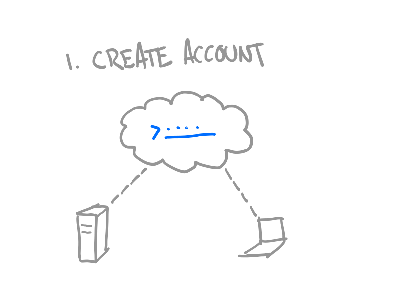

# Overview

 

There are two ways to use remote.it to connect. Web connections connect through a cloud proxy and only require our extension to be installed on the target system. Direct connections require remote.it

## Web connect


We are actively working on adding more helpful documentation to this site. If you have suggestions, [please contact us](https://remot3it.zendesk.com), we'd love to hear from you!


### Features and requirements

* Secure connections
* Last 8 Hours
* Cloud based proxys
* Installation on target system only
* Connections created through remote.it web interface

## Direct connect

Features and Requirements

* Secure connections
* Fastest speeds available
* Connections last indefinitely
* Installation on both systems required
* Connection through remote.it web interface

## Getting started

If you're new to remote.it, we highly recommend starting with our Getting Started guides:



## Looking for API docs?

If you're a developer looking to integrate remote.it into your product or application, please checkout our API documentation guides here:



## Feedback and Support

Have feedback, questions, or need some help? [Please contact us](https://remot3it.zendesk.com)!

