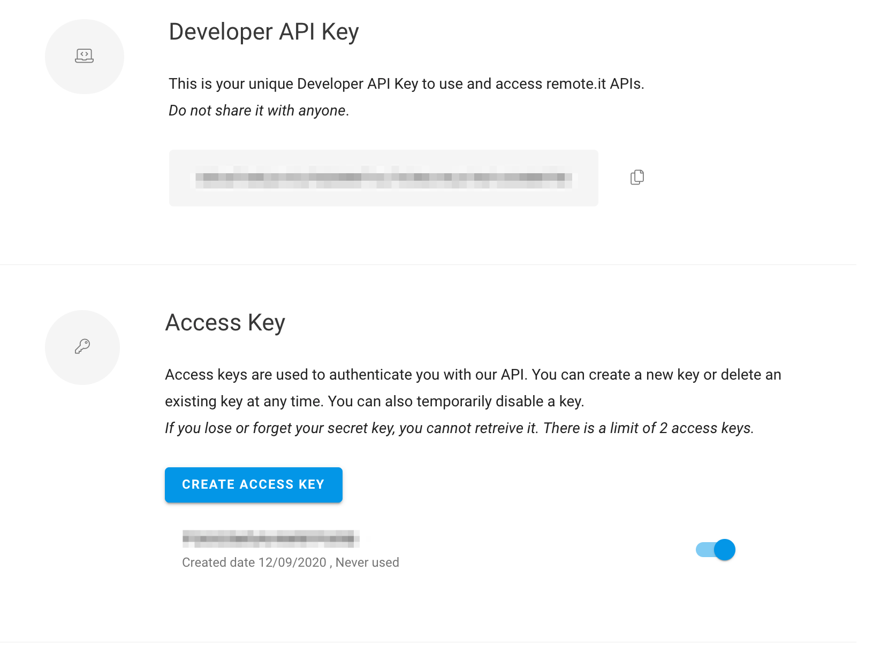
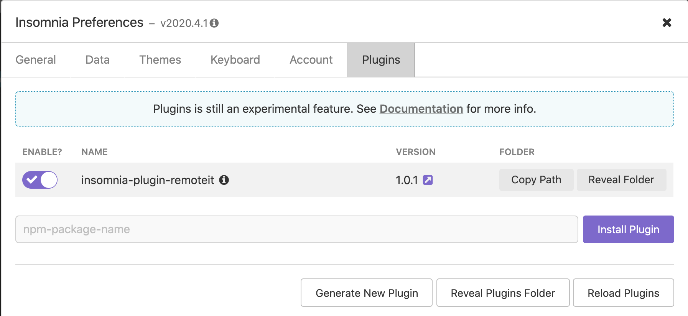

# Authentication

The GraphQL API requires authentication for queries and mutations. remote.it authentication uses HTTP Request Signature. The advantages of this method are:

* keys do not expire
* keys can be disabled and revoked \(deleted\) by the user at any time
* keys are not dependent on password
* keys are more secure

## Key Management

You can generate, enable, disable and delete keys in the Account section of the web portal here [https://app.remote.it](https://app.remote.it). Screen shot is provided below. 


_**Please note: Generation of keys is crypto-random and the secret is only available immediately after creation by clicking the “Show secret access key” link or downloading the key as a CSV file \(containing the Access Key ID and Secret Access Key\)**_




You are limited to 2 active access keys. The account page will also show when the key was created and last used for authentication. If you suspect your key has been compromised, generate a new one, replace it in your code and disable. If desired you can delete the compromised key after disabling it.

### Create a remote.it Credentials File

You will need to follow the steps above with Key Management to generate your access key and secret before proceeding

Create the following file to save all your [remote.it](http://remote.it/) credentials. The file must located be in ~/.remoteit/credentials \(in your home directory\). For windows, the directory is C:\Users\&lt;name&gt;\.remoteit\credentials with no extension. 

The file is in the standard ini file format:

```text
[default]
R3_ACCESS_KEY_ID=Z5QCS6ZO7POELMVDNOYJ
R3_SECRET_ACCESS_KEY=cgMWC14Qsktnq/nbF+iZzy2q2yc4sVPkQn3J0m5i
```

You can save more than one key pair under different profiles \(sections\) in the remote.it credentials file. Profile names are case-insensitive, cannot contain a period \(.\) and default is the default profile name.

## Using GraphQL

Insomnia is a graphQL IDE which can help you explore the graphQL schema, generate queries and mutations.

### Download and Install Insomnia



It is recommended that you install Insomnia Core rather than Insomnia Designer, but the plugin should work for both versions.

### Add the Plugin to Insomnia

We will be using a remote.it provided plugin to create queries which will automatically sign the requests.

Go to preferences:



Enter insomnia-plugin-remoteit and click _Install Plugin_

### Generate a Request

Make sure to create a _**POST**_ request and select _**GraphQL Query**_ as Body type. NOTE: All graphQL queries and mutations are made with **POST**

You can type a sample GraphQL query to [https://api.remote.it/graphql/v1](https://api.remote.it/graphql/v1) like:

```text
{
  login {
    email
  }
}
```

Select the _**Auth**_ tab of the query and select _**Bearer Token**_ authentication. You then can click on the _**remote.it API authentication**_ tag, and select a specific profile otherwise the default profile will be used. 

You now can send the request and execute the query using the credentials stored earlier.

## API Request Signing

To authenticate an API request, the client must generate a signature using the previously created key and secret.

Here are a few examples:



This example is using a helper library requests\_http\_signature for python which will sign the request before submitting it to the server. This demonstrates how to safely reference the key and secret from environmental variables rather than including it in the code.

```text
import binascii
import os

import requests
from requests_http_signature import HTTPSignatureAuth

key_id = os.environ.get('R3_ACCESS_KEY_ID')
key = os.environ.get('R3_SECRET_ACCESS_KEY')

response = requests.post('https://api.remote.it/graphql/v1',
                         json={"query": "query { login { id email devices { items { id name }}}}"},
                         auth=HTTPSignatureAuth(key=binascii.a2b_base64(key), key_id=key_id))

if response.status_code == 200:
    print(response.text)
else:
    print(response.status_code)
```



Enter access key, secret and developer key which will call the graphql request in the script using openssl

```text
#!/bin/bash

KEY_ALIAS="ACCESS_KEY"
SECRET_BASE64="ACCESS_SECRET"
SECRET=`echo ${SECRET_BASE64} | base64 --decode`
DEVELOPER_KEY="DEVELOPER_KEY"

HOST="api.remote.it"
URL_PATH="graphql/v1"
URL="https://{$HOST}/{$URL_PATH}"

VERB="POST"

CONTENT_TYPE="application/json"

LC_VERB=`echo "${VERB}" | tr '[:upper:]' '[:lower:]'`

DATE=$(LANG=en_US date "+%a, %d %b %Y %H:%M:%S %Z")

DATA='{ "query": "{ login { email  devices (size: 1000, from: 0) { items { id name services { id name} } } } }" }'

CONTENT_LENGTH=${#DATA}

SIGNING_STRING="(request-target): ${LC_VERB} /${URL_PATH}
host: ${HOST}
date: ${DATE}
content-type: ${CONTENT_TYPE}
content-length: ${CONTENT_LENGTH}"

echo ${SIGNING_STRING}

SIGNATURE=`echo -n "${SIGNING_STRING}" | openssl dgst -binary -sha256 -hmac "${SECRET}" | base64`

SIGNATURE_HEADER="Signature keyId=\"${KEY_ALIAS}\",algorithm=\"hmac-sha256\",headers=\"(request-target) host date content-type content-length\",signature=\"${SIGNATURE}\""

curl -v -X ${VERB} -H "Authorization:${SIGNATURE_HEADER}" -H "DeveloperKey:${DEVELOPER_KEY}" -H "Date:${DATE}" -H "Content-Type:${CONTENT_TYPE}" ${URL} -d "${DATA}" --insecure
```



You can reference different standard implementations of the signature in different languages from w3c-ccg [https://github.com/w3c-ccg/http-signatures/issues/1](https://github.com/w3c-ccg/http-signatures/issues/1)




