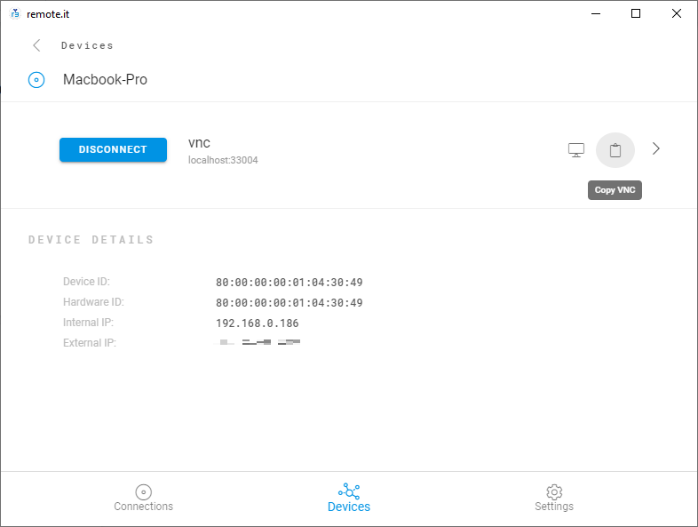

# Connect Remotely

Now, open the remote.it Desktop Application from the Windows machine that will be your controller. Make sure that you log in with the same remote.it credentials you used earlier.

After a few minutes, the target macOS Device will appear under the _Devices_ tab. Click on it and you will see the Service you registered. 

Click the green “Connect” button. Once connected, the button will turn blue. You will see a clipboard icon next to the Service name. Click the clipboard to copy the VNC string to your clipboard.

This is the address you will use to connect to your macOS Device. Open up the VNC client application you installed earlier. We use RealVNC’s VNC Viewer. Paste the VNC string into the appropriate text field and hit enter. 

VNC Viewer will ask for the username and password to the macOS Device. Enter the proper credentials and click “Ok”.

You are now remotely connected to your macOS Device! 

Check out our other useful guides:









