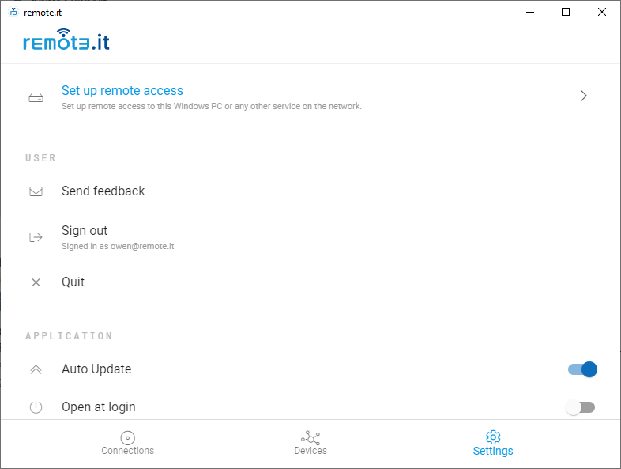
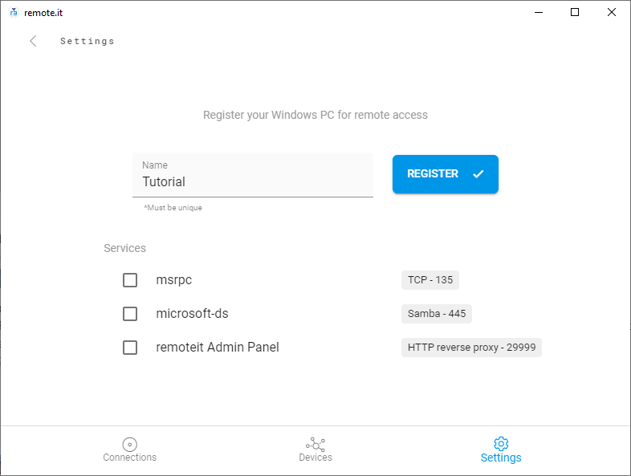
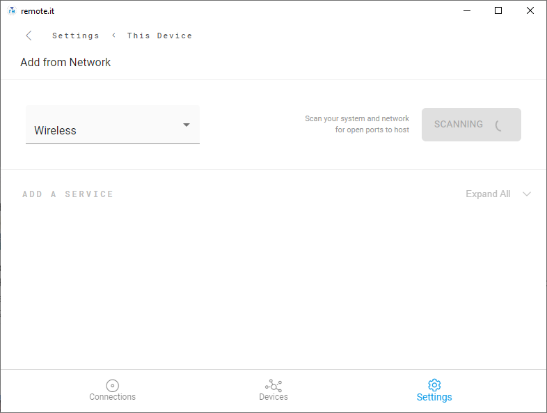
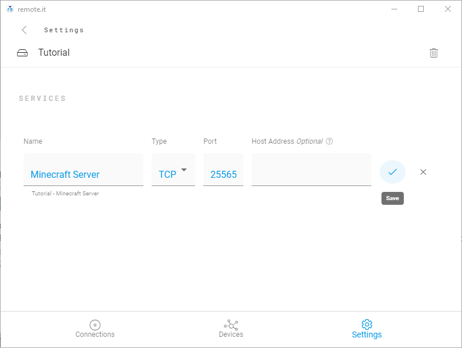
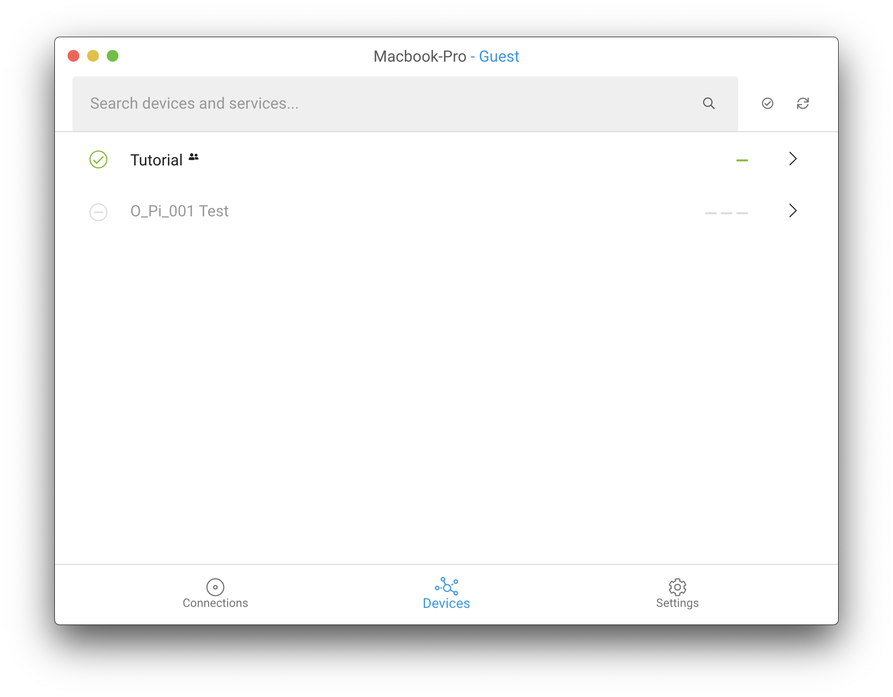
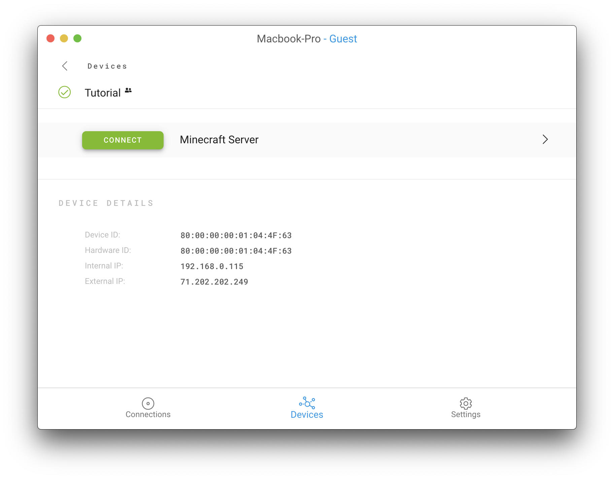
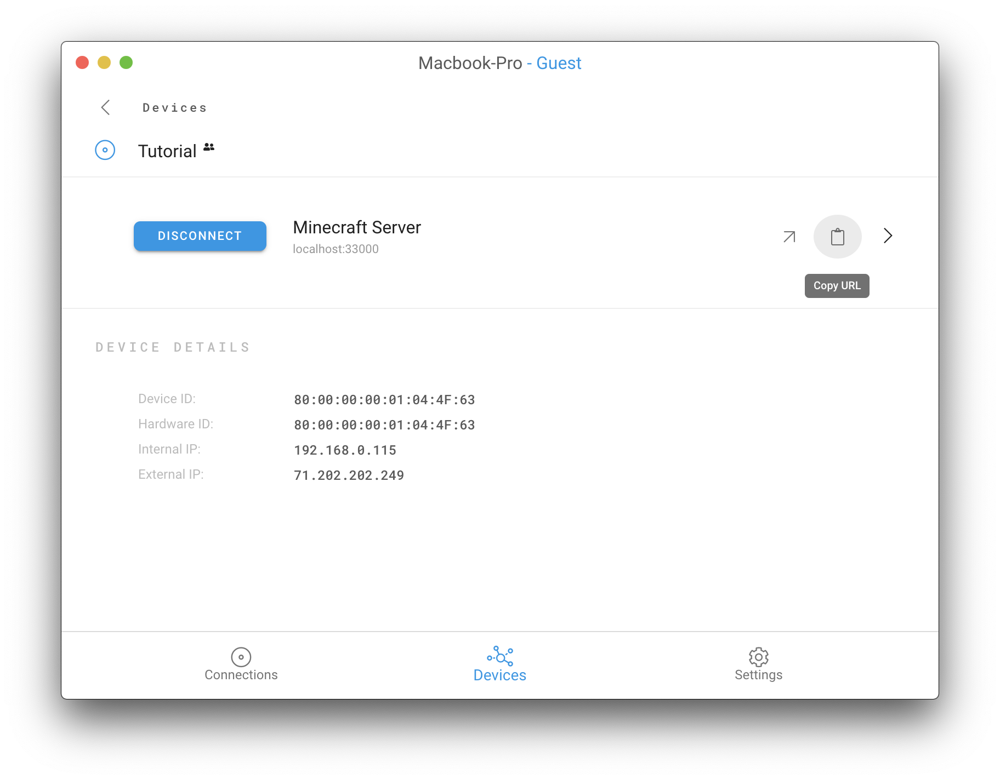
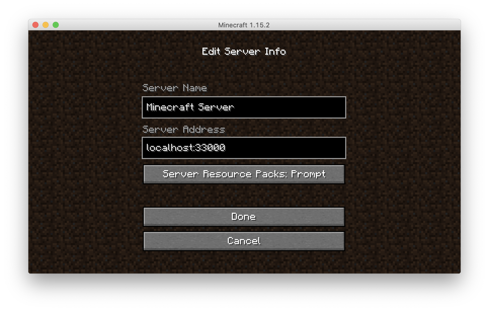

# Hosting a Minecraft Server

## Overview

In this guide you will learn how to host a Minecraft multiplayer server using remote.it. Hosting a server in this way is secure, totally free, and doesn't require port forwarding. Additionally, you only have to go through this set up process once, and anyone else using remote.it can join.

**The steps to setup are:**

1. Set up a Minecraft Server.
2. Host the server using remote.it.
3. Share the server with whoever you want.
4. Connect to the server through remote.it.
5. Connect to the server through Minecraft.

## Set up

Before starting the process of setting up your Minecraft server to run on remote.it, please make sure to [**create**](https://app.remote.it/auth/#/sign-up) an account and [**download**](https://downloads.remote.it/desktop/latest/remoteit-installer.exe) and install the desktop app. If you need help setting up a Minecraft server, there are many resources online detailing [**how to**](https://minecraft.gamepedia.com/Tutorials/Setting_up_a_server), as well as a remote.it ****[**video tutorial.**](https://www.youtube.com/watch?v=natSu296POg) ****

Additionally, please be aware that setting up a Minecraft server on a Mac is slightly different from setting up a server on a Windows machine. When creating the server on the Mac, it is not necessary to create a .bat file. Simply run the .jar file to start the server.


**NOTE:** DO NOT port forward! Set up the server to run on your machine locally and remote.it will take care of the rest.


Below is an image of what your server should look like when it's ready to be hosted. You should be able to connect to it using your local IP address, but it won't be accessible by anyone outside of your local network yet.

## Host using remote.it

Launch the desktop app and log in, then navigate to the _Settings_ tab at the bottom and click "Set up remote access" to register your device.

Enter a name for your Device and select any of the quick-add Services you wish to add. The Minecraft server Service will be a quick-add option if your Minecraft server is running in the background. Make sure it's checked, then hit "Register."


**Note:** If the Minecraft server doesn't show up as a quick-add option, continue with this section of the tutorial. Otherwise, continue on to the next section, titled "Share the server".


After your computer is registered, click the "x" in the upper right-hand corner to dismiss the message.

Then, click the blue button that says "Add from network." This will scan your network and detect your Minecraft server. Make sure your Minecraft server is running before scanning. 

Scroll down and find your system, labeled _This system_.

Click on your IP address. If your Minecraft server is running, the app will detect and display it.

Click the add button next to the Minecraft Server option.

Enter a name for your Service, and leave everything else the way it is. Click the blue check mark to add the Service when done.


**NOTE:** If the Host IP Address is blank, don’t worry about it. The app will fill it in for you once you press the check mark.


## Share the server

The server is now hosted through remote.it. To allow players to join, you must share the device with them. Make sure that everyone who wants to access the server has a free remote.it account and has downloaded the desktop app. 


**Note:** There is an even easier way to share a Device with your contacts! Check out the documentation on Port Sharing!




Go to [**app.remote.it**](https://app.remote.it/auth/#/sign-in) ****and navigate to the _Contacts_ page. Click the _Create Contact_ button and enter the name and email of the person you wish to add to your server. Then click _Create Contact_. 

Navigate to the _Devices_ page and click the check mark next to the device that is hosting the server. Click on _Actions_, then _Share_. Choose the people you want to play with from the drop down menu and _Add Sharing_.


**NOTE:** You should not allow contacts to execute scripts on the device.


Now, have the people you want to play with log in to the desktop app. 

## Connect using remote.it

The device will appear under the _Devices_ tab in a minute or two. 

They should click on the Device, then click _connect_ to connect to the server. 

## Connect with Minecraft

When connected through remote.it, a clipboard icon will appear. Click it, and the IP address for the Minecraft server will be copied to your clipboard. 

Paste it into the Minecraft Server Address field and you will be able to connect.


**NOTE:** If http:// appears before the server address, be sure to delete it before attempting to connect.


**You’re done!** As long as remote.it is running on both machines and the Minecraft server is up, you will able to play Minecraft together securely without port forwarding.

## More

Please check out our other potentially useful guides!







