# Remote Access a Windows computer from a Mac

## Overview

Before you begin, you will need to:

1. Create a remote.it account at the remote.it website, found [**here.**](https://remote.it/)\*\*\*\*
2.  Install the remote.it Desktop App on both computers \(Mac & Windows\), found [**here.**](https://remote.it/downloads/)\*\*\*\*
3.  Install a RDP client on the Mac computer. We recommend using Microsoft Remote Desktop, which can be found [**here.**
   ](https://apps.apple.com/us/app/microsoft-remote-desktop/id1295203466?mt=12)
4. Both devices must be on, awake, and connected to their respective networks
   .


**Note:** The methods presented in this tutorial can only be used if the target Windows computer supports Remote Desktop \(RDP\). This includes editions such as Windows 10 Pro and Enterprise. In the case that your target Windows device does not support RDP, you will need to use another remote connection software such as VNC.



Check out the official remote.it video tutorial on this subject, found [**here!**](https://youtu.be/AWPSEDCa2No)\*\*\*\*


## Set up RDP Remote Access

In order to remotely access a Windows device, you will need to set the RDP remote access permissions on the device you would like to connect to. 

Start by opening the “Control Panel”, and click on “System and Security”. 

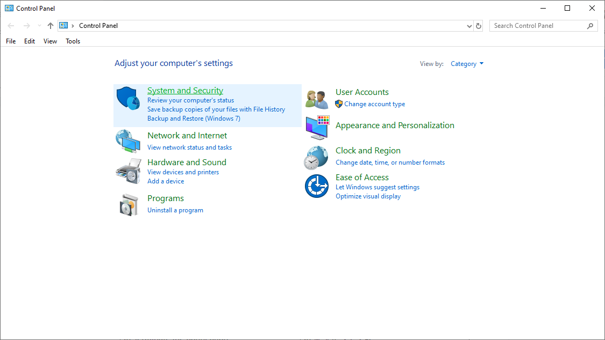

Find “System” and click on “Allow remote access”. A “System Properties” dialog will appear.

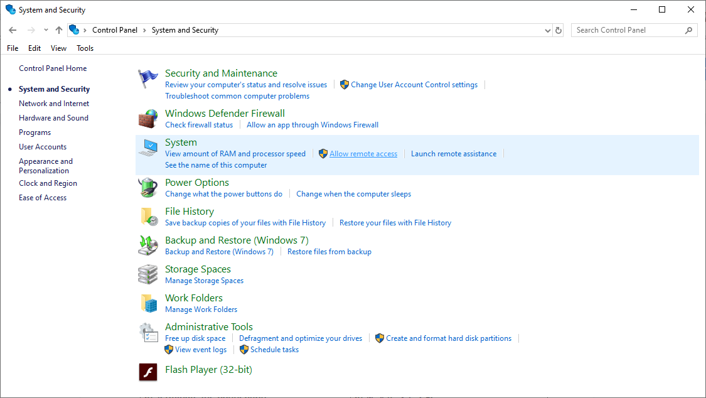

Under “Remote Desktop”, select “Allow remote connection to this computer”. A dialog will appear if your computer is set to go to sleep while not in use. 

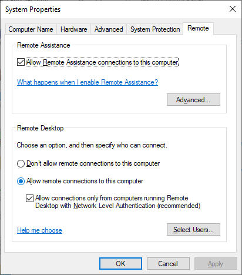

Your computer must be awake to connect to it remotely, so to change this setting, click on “Power Options”. 

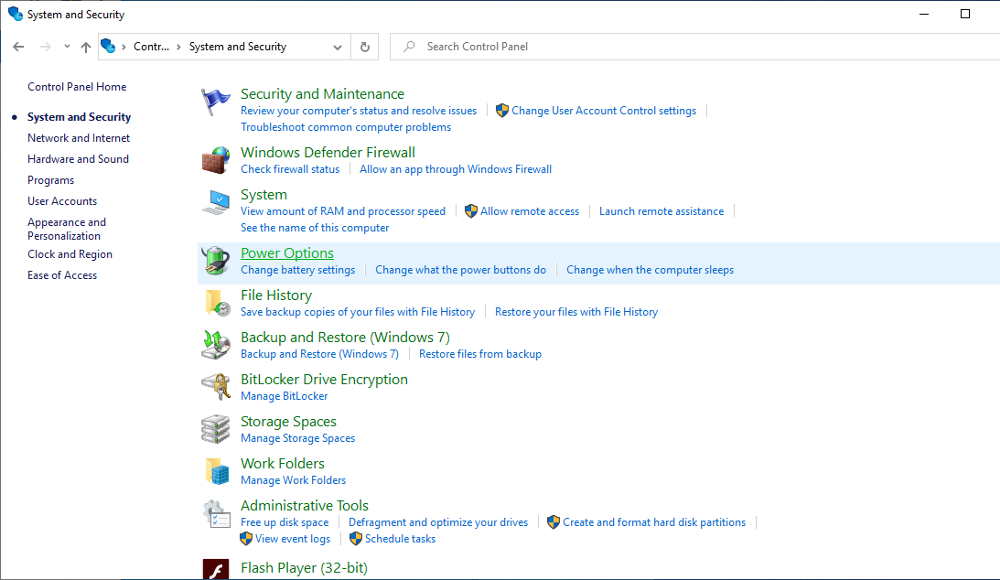

Next to Balanced, click “Change plan settings”. Then under the “ Put the computer to sleep” dropdown menu,  select “Never”. Then click “Save changes”. 

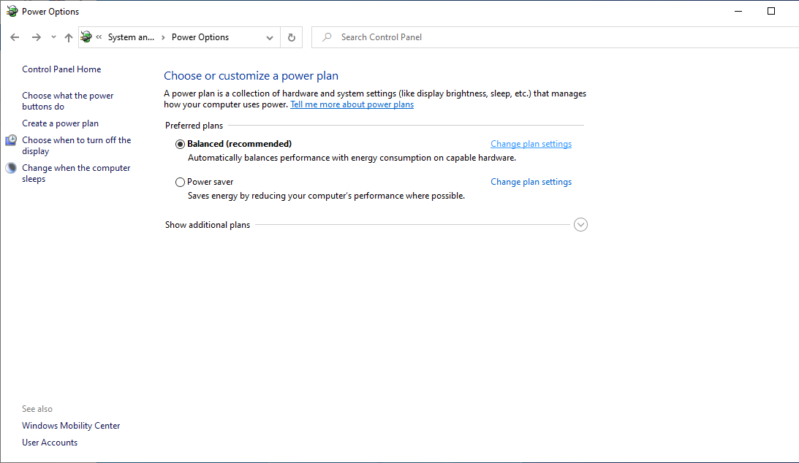

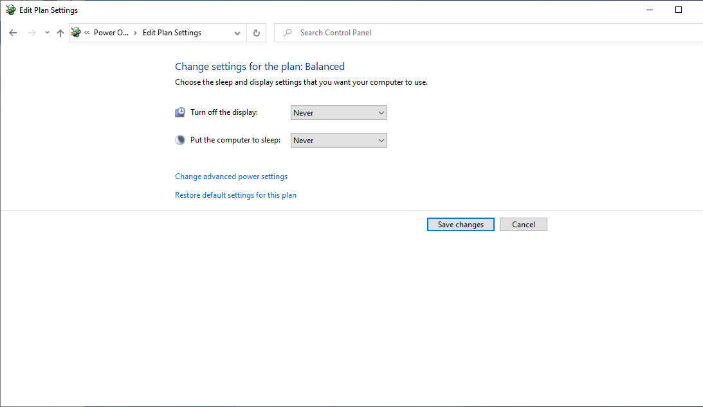

RDP has now been enabled on the device. 

## Register the Target Device

The next step is to register the device you want to connect to with remote.it.

Open the remote.it Desktop App on the target device and sign in. The Settings tab will be open. Click on “Set up remote access.”

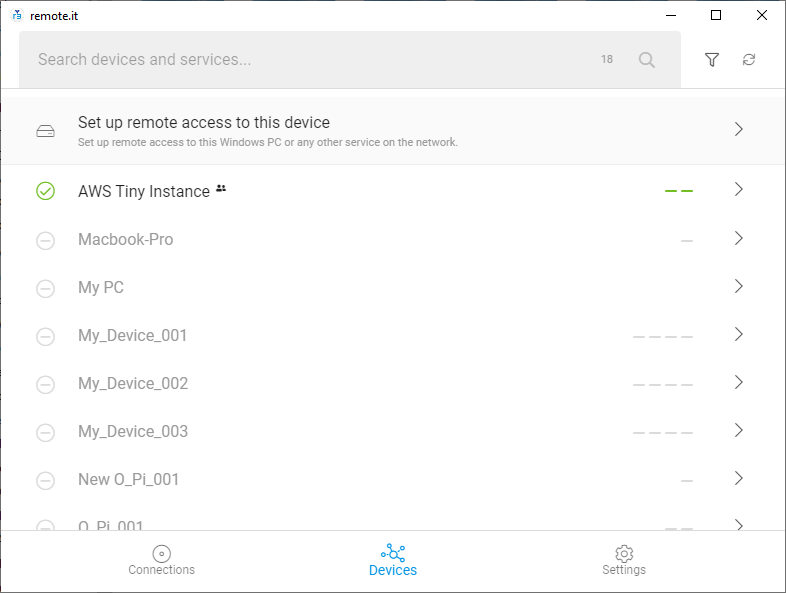

By default, the device in your remote.it account will be given the same name as your PC. If you would like to change it, this name can also be edited. I changed mine to target-device.

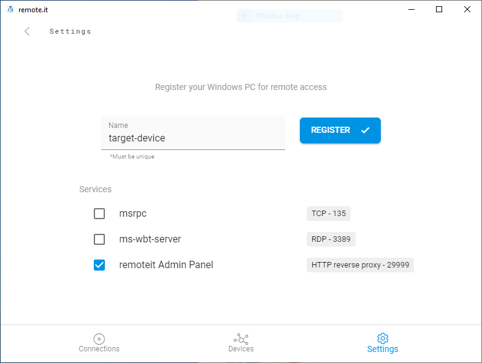

Some of the quick-add services will already be checked. You can actually select the box next to “ms-wbt-server”  because that is the type of service that you will be connecting with. But for the purposes of this tutorial, I will be manually adding a service later.

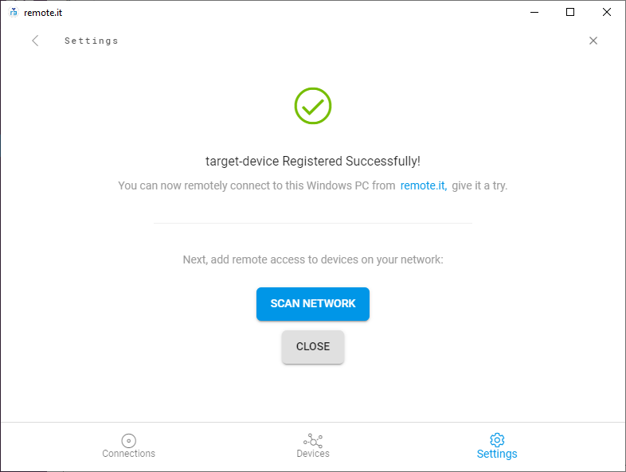

Click the blue register button. When this green check mark appears, the registration process for the device is complete.

## Create an RDP Service

After registering the device, in order to make a connection to it, you need to add an RDP service. To do this, go back to the Settings tab, and click on the name of your Device.

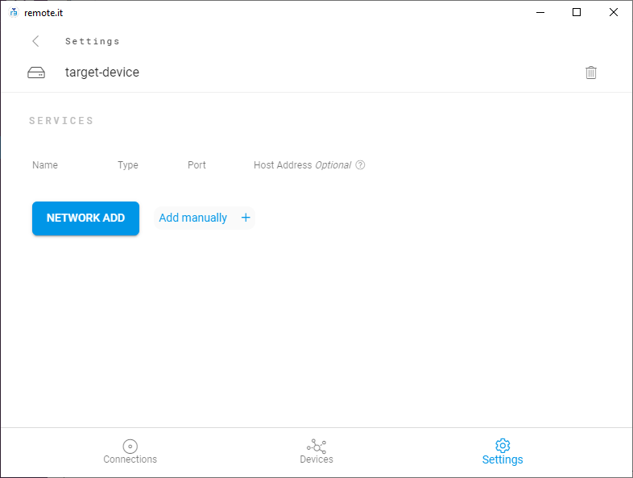

Then under Services, click “Add manually.” Enter a Service name here. Then under “Type”, select “RDP” from the drop down menu. 

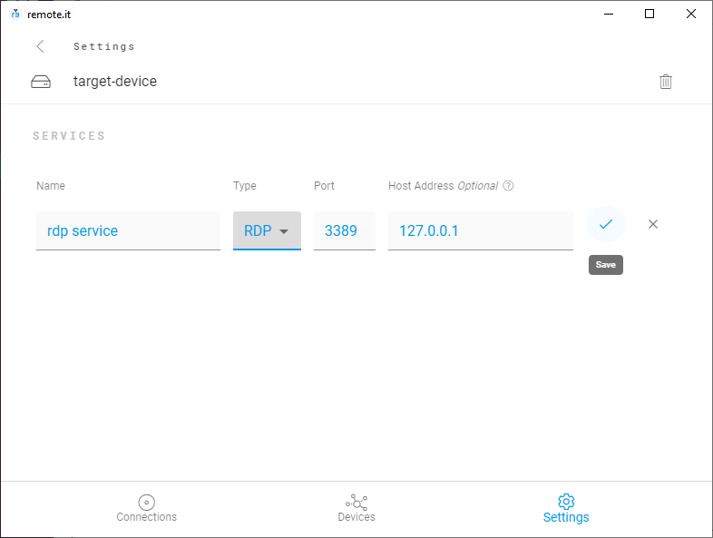

Port 3389 will be selected by default. This is the port number that Windows automatically assigns to RDP, so it should not be changed. The host address should also be left as the default.

Note that adding this service is not opening this port to the internet. It will only be accessible from your remote.it account. 

Click the check mark to save the service, then go to the “Devices” tab in the bottom menu. The device you just registered will now be displayed.

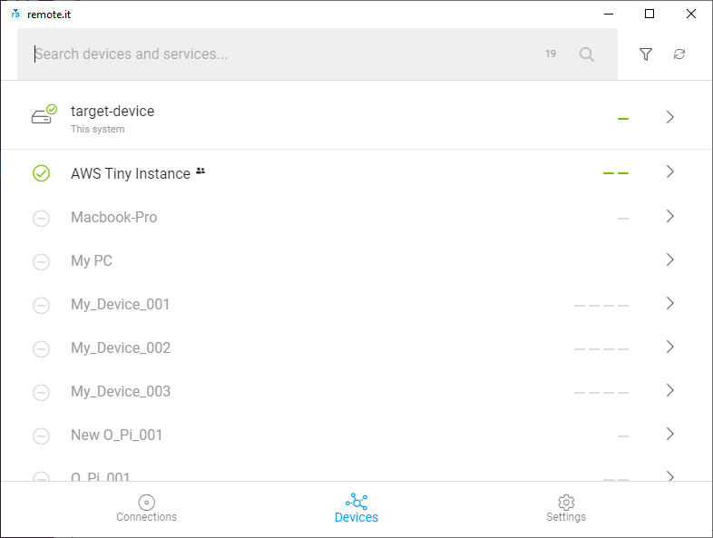

When the device is online, a green check mark will appear. If you click on the device, you can also see the RDP service you just registered.

Now you are ready to connect remotely.

## Connect Remotely from a Mac

Now, from a Mac computer on a different network, open the remote.it Desktop App and log in with the same remote.it credentials you used earlier.

After a few minutes, the Device you registered earlier will appear under the Devices tab. Click on the device. You will see the RDP service you registered earlier. Then click the green “Connect” button next to the service.

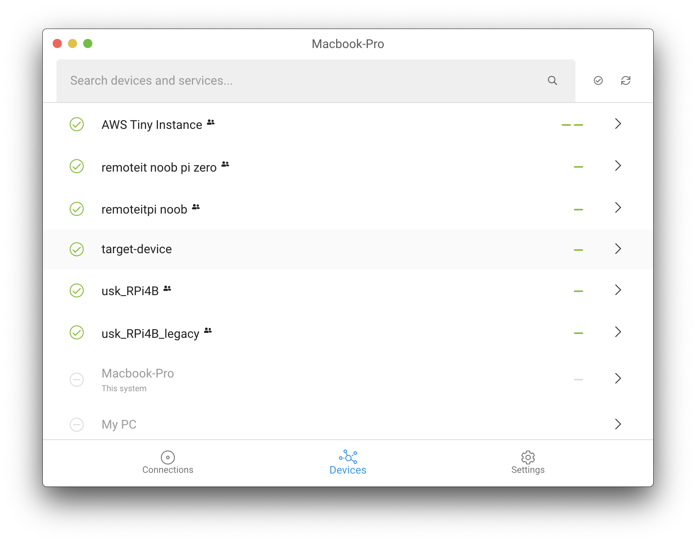

Once you’ve connected, the connect button will turn into a blue, indicating that you are now connected. This is the address that you will use to connect to your device. This is a localhost address meaning that by using it, you will be directly connecting to your target Windows device.

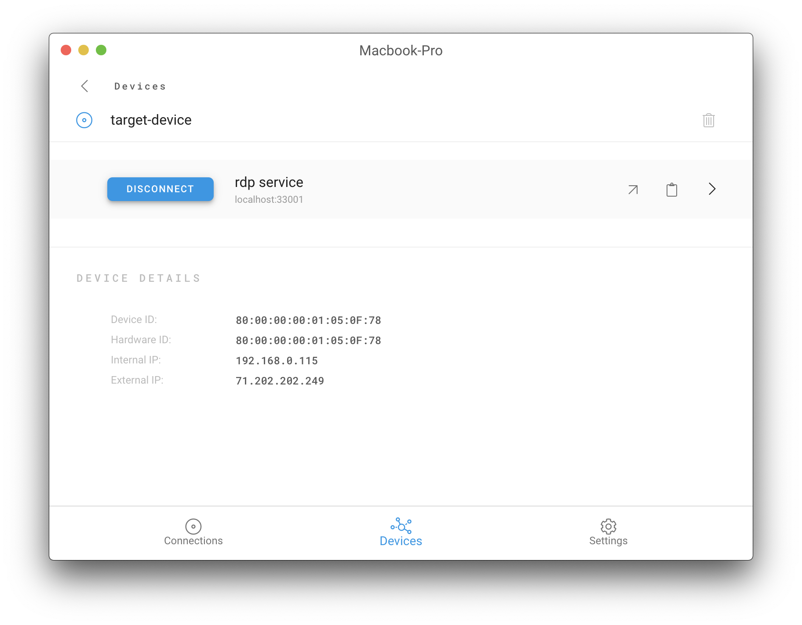

This is also known as a Peer 2 Peer connection. For more information about Peer to Peer Connections, check out the information below:



Click on this clipboard icon to copy the address and open the RDP client application. Then click “Add PC.”  

A window will appear. Paste the localhost address, then click “Add.”

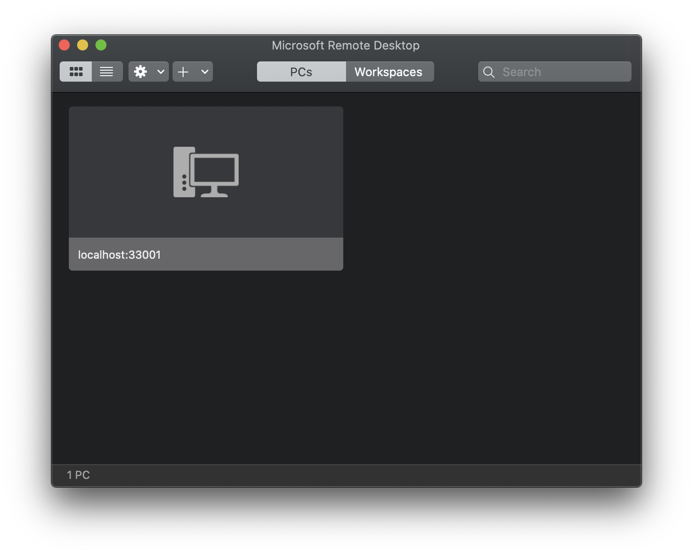

Then click on the box with your localhost address in it. Enter the credentials of the computer you are connecting. Then click “Continue.”

You will see a warning from the Microsoft RDP software about a self-signed certificate. This warning is to be expected unless certificates have been configured. Remember remote.it just acts to carry the Microsoft connection. 

If you are planning to frequently remotely connect to your Windows computer, and would like to get rid of this pop-up, please see the information provided below:



Your Windows desktop will open and you can use it as usual!

## Terminate the Connection

To stop the connection, close the RDP client application, then open the remote.it desktop application.

Then you can either go to the Devices tab and click the Disconnect button next to the service you would like to stop. 

Alternatively, you can go to the “Connections” tab in the bottom menu. Click the “Disconnect” button next to the service you would like to stop. 

You can also go to the task tray. Click on the remote.it logo. 
Find the service you would like to stop
 and press disconnect. 

When the disconnect button turns green, the connection has been terminated.

