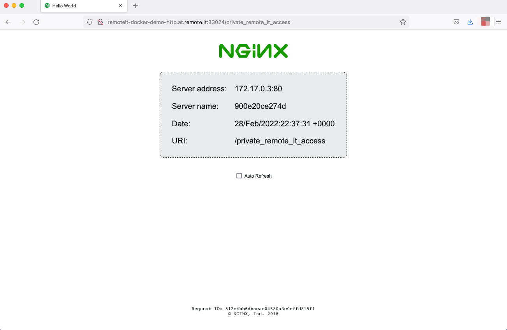

# Docker

The following instructions would allow you to deploy the remote.it device package in a docker container with a base openWrt image. Your container would be a device available as any other and you can securely access it over remote.it. With additional docker and remote.it Service configurations you could directly access the host OS and other containers if ports and services are available. This is not a docker use guide, this is a quick way to get remote.it in its own container.

.png>)

The goal of these instructions is to have a dedicated remote.it container used to target the host OS and other containers if you can not install remote.it directly on the host OS. We are working on a version of remote.it to deploy into any existing linux based containers that would allow you to treat each individual container as its own device for monitoring and access.

#### Considerations

1. The CPU architecture of your host operating system
2. The docker base image architecture&#x20;
3. The remote.it [device package architecture](../software/device-package/supported-platforms.md#device\_package\_supported\_platforms)
4. Should the remote.it configuration persist through up/down cycles.&#x20;

## Proof of concept

Getting the openWrt image, this example uses the x86-64 tagged build.

```
docker pull openwrtorg/rootfs:x86-64
```

### Docker Run

This is the base configuration using defaults in the openWrt image.&#x20;

```
docker run -d 
--name remoteit_docker_demo
--hostname remoteit_docker_demo 
-v ${LOCALPATH}:/etc/remoteit 
--add-host=host.docker.internal:host-gateway
openwrtorg/rootfs:x86-64

```

| Flag       | Purpose                                                                                                                                                                                                        |
| ---------- | -------------------------------------------------------------------------------------------------------------------------------------------------------------------------------------------------------------- |
| --name     | Sets the container name for your use                                                                                                                                                                           |
| --hostname | Sets the hostname inside the container and will be used as the **device name** in remote.it's device list                                                                                                      |
| -v         | local mapping of the config file used by remote.it - this is required if you want the container to persist as the same remote.it device between up/down cycles. Replace ${LOCALPATH} with your local settings. |
| --add-host | This may not be required based on the docker daemon version. This adds DNS entries to easily target the Docker network.                                                                                        |

### Install and register&#x20;

Using our [quick start](../#quick-start) instructions we can enter the container and quickly install the latest version of remote.it and register it in just 1 command. cURL is required for the install script. The registration code will be unique to your account.

```
docker exec -it remoteit_docker_demo /bin/sh
/ #: opkg update
/ #: opkg install curl
/ #: R3_REGISTRATION_CODE="<your_registration_code>" 
sh -c "$(curl -L https://downloads.remote.it/remoteit/install_agent.sh)"
```

.png>)

### Configure and Connect

Now add a new SSH service or modify the existing one to target the host OS for direct access. Note the change to service host address. It defaults to 127.0.0.1(the container) and it's been updated it to use docker's DNS that will be available to the container.

.png>)

Target any kind of service that is running on the local network, host OS, or other containers that have exposed ports.&#x20;

This example is running a second container with a NGINX web server that publishes port 55000 to the host OS.&#x20;

.png>)


