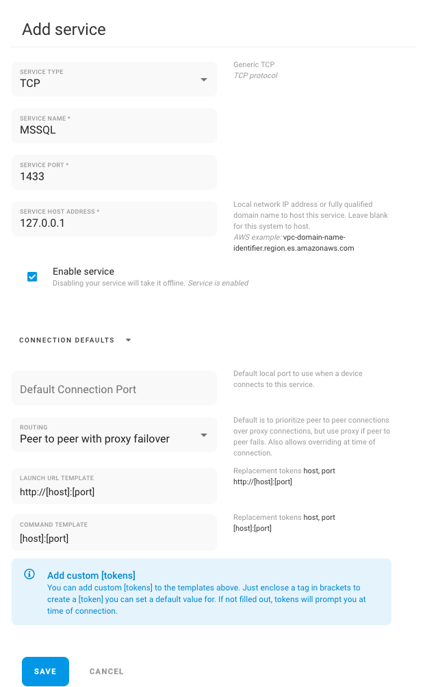

# Database

If you install Remote.it directly onto the server hosting your database the below is the needed setup on port 1433 as the default port for Microsoft SQL. This connection type will support any database given the correct port.

If running a database on another device or as a service you change the Service Host Address with the fully qualified domain name.

