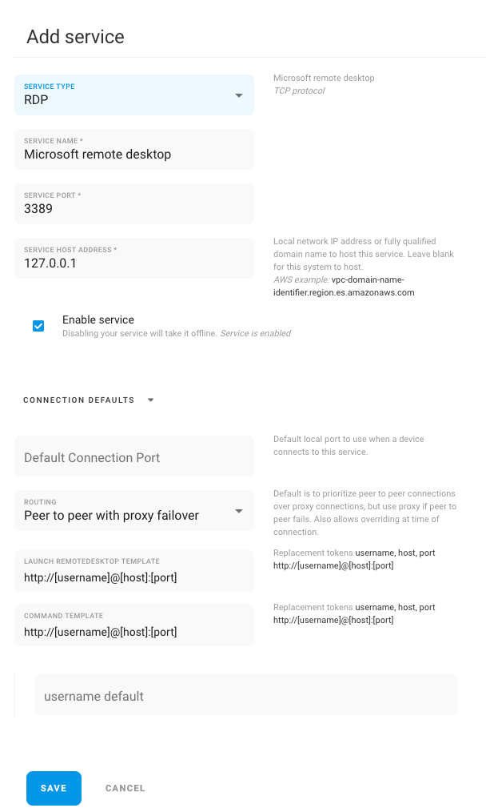

# RDP and VNC

Remote.it has pre-built service types for RDP and VNC to connect over NAT. Confirm RDP and VNC servers are running on the remote device [first](https://support.remote.it/hc/en-us/articles/360044517231-Control-your-Windows-Device-Remotely-Windows-to-Windows-), add your service with the configurations below and you'll be able to connect with the applications you already use.&#x20;

## RDP

## VNC

