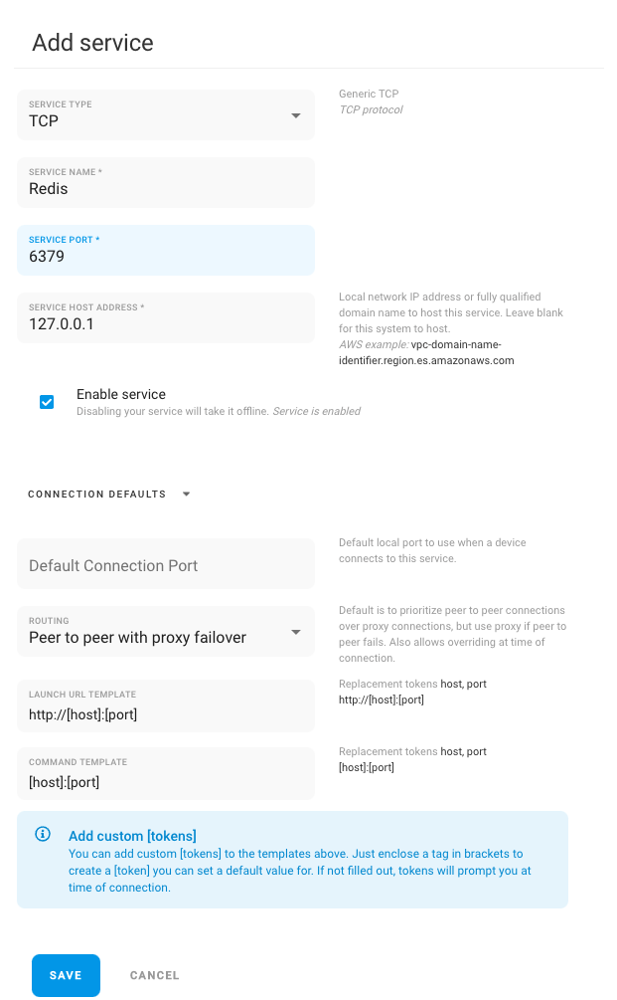

# Redis

If you install Remote.it directly onto the server hosting redis the below is the needed setup on port 6379. This works for other cache services so long as they listen on a particular TCP port.

If running redis on another device or as a service you change the Service Host Address with that fully qualified domain name.

