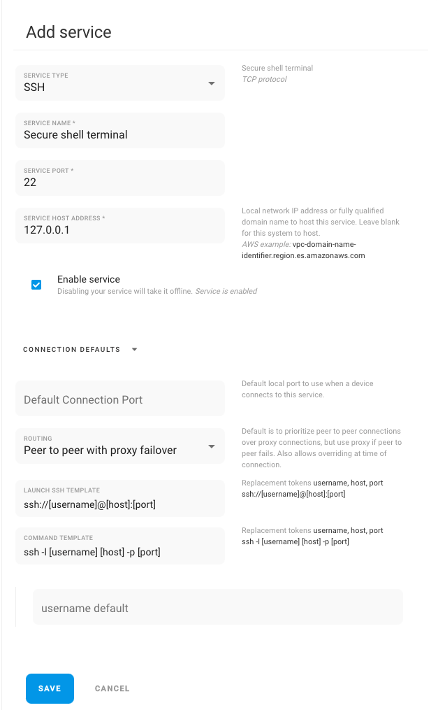

# SSH

Remote.it has a pre-built service to connect to SSH on devices behind NAT to perform any function  on the terminal.&#x20;

Create and enable your service then use your favorite app to connect. SSH will auto-launch to the terminal (Linux/MacOS), putty (windows), terminus (mobile) if installed.

