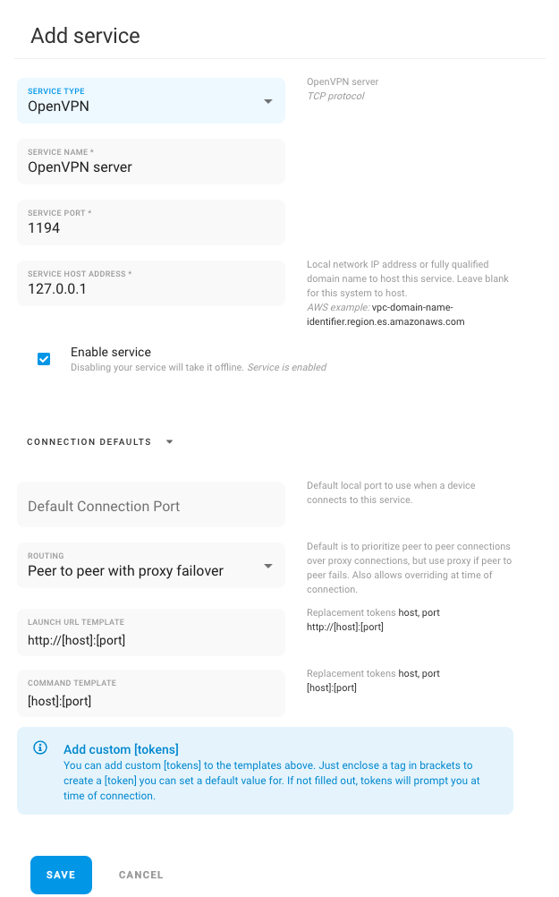

# VPN

remote.it has default service configurations for some of the most popular VPN solutions. Registering 1 or more VPN services on a device allows you to access multiple VPNs without constantly reconnecting and disconnecting.

