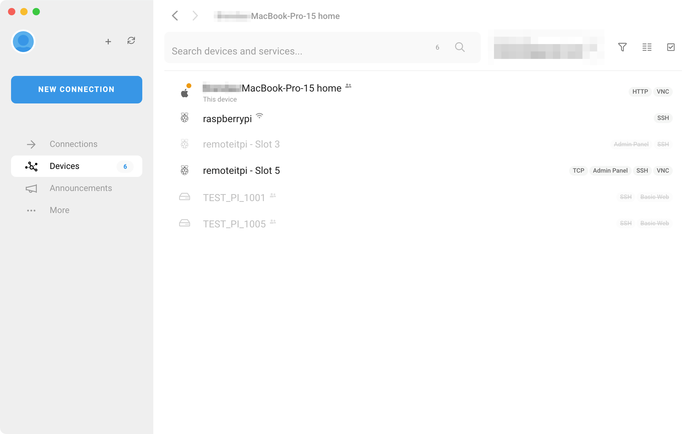

# Connecting Using the Desktop Application


Prerequisites: 

1. You have a remote.it account \(If not, please go ahead and create an account at [https://app.remote.it](https://app.remote.it)
2. You have installed the remote.it Desktop application on a machine you will be using to configure and connect to your device. \(This doesn't need to be on the same network as the device you are setting up\) See [https://remote.it/download/](https://remote.it/download/) for the different options available.
3. You have access to one or more devices


From the Devices panel, locate the device to which you want to connect. The services available will be located to the right. In this case, I will be connecting to the SSH service on the device named raspberrypi.

Click on the service and create connection. If the service is online, then the connection will be successful.   
You can then use the launch or the copy button to use the connection in the appropriate app.  


You can update the connection configuration for each service. For example to override the local port used or the username on the connection. 


