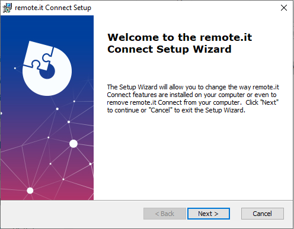
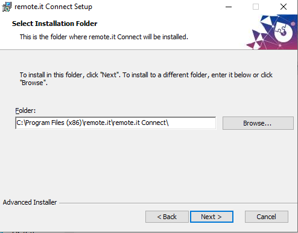
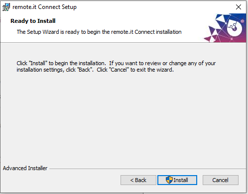
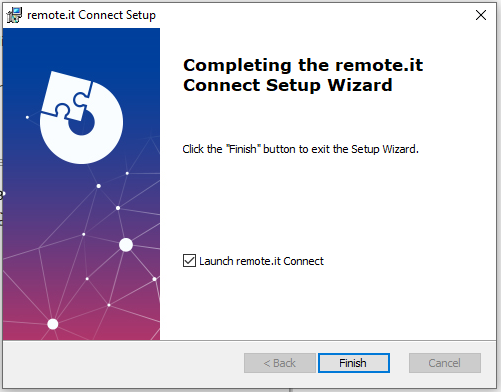

# Windows Quick Start

## **Features**

Windows Connect offers two modes:

1. **Initiator Mode** Create a peer to peer \(P2P\) connection from your Windows PC to any remote.it enabled service on another device.
2. **Target Mode** Allow other authorized remote.it users to connect to your machine. Remote Desktop \(usually port 3389\) or a web server using IIS \(usually port 80\) are common uses. 

After you set them up, both types of remote.it connections will run whenever you start your Windows PC, whether the remote.it Connect for Windows application is running or not.

### **Peer to peer connections** 

Connect is the easiest way to make P2P connections on Windows. Learn more about the benefits of P2P connections:



## **Installation** 

Get Windows Connect from our downloads page:



Download the `WCM_1_7_10_101618.ZIP` file and extract the installer folder `WCM_1_7_10_101618` ****to your hard drive.

Open the `WCM_1_7_10_101618\r3_ConnectServiceSetupAI-SetupFiles` folder and double click on the installer program **`r3_ConnectServiceSetupAI.msi`** to launch the remote.it Connect for Windows installer.

Click on "Next" to continue.

We suggest that you use the default installation folder, but you can change it if you like.  Click on "Next" to continue.

Click on "Install" to complete the installation.

A User Account Control dialog will appear, asking if you want to allow the program to make changes to your computer.  The company name will be spelled "REMOT3.IT" in this dialog. Select "Yes" to continue.

Click on "Finish".  Leave the checkbox selected to start remote.it connect.

