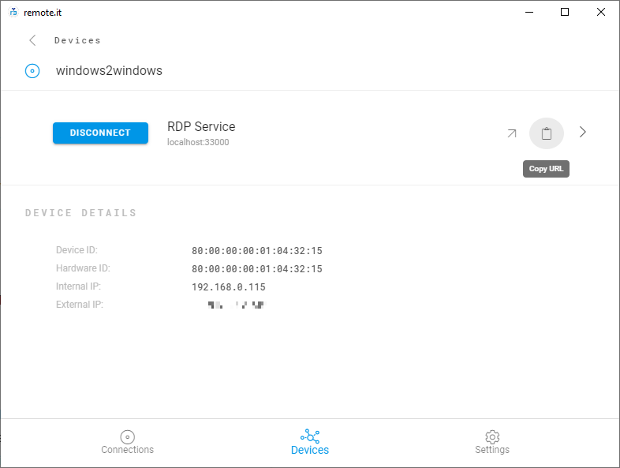

# Connect Remotely

Open the remote.it Desktop App on the computer you will be connecting from and sign in with the same credentials as you used on the other device.

After a few minutes, the Device you registered earlier will appear under the _Devices_ tab. Click on it, and you’ll see the RDP Service that you created.

Click the green “Connect” button next to the Service. The button will turn blue, signifying that you are now connected.

Click the clipboard icon to copy the address to your clipboard. This is the address that you will use to connect to the original Device. 

It will be a localhost address, meaning that you will be connecting directly to your target Device. This is known as a Peer to Peer Connection. If you're curious about Peer to Peer Connections, check out the following guide:



Once the address is copied to your clipboard, open the RDP client application on your client Windows machine. It is called “Remote Desktop Connection”. Paste the address into the text field and click “Connect”.

Enter the username and password of the target Windows Device and press “Ok”. Click “Yes” when prompted.

You are now remotely connected and controlling your Windows Device and can use it as usual! 

Whenever you want to access the connection, just connect through the remote.it Desktop App, copy the address, and paste it into the RDP client.

Continue with the tutorial to learn how to terminate your connection:



