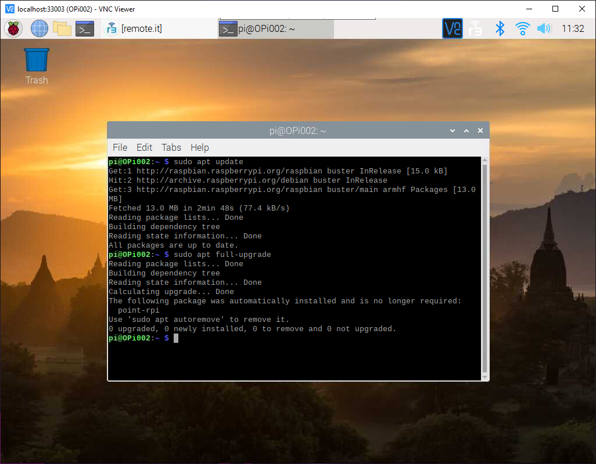
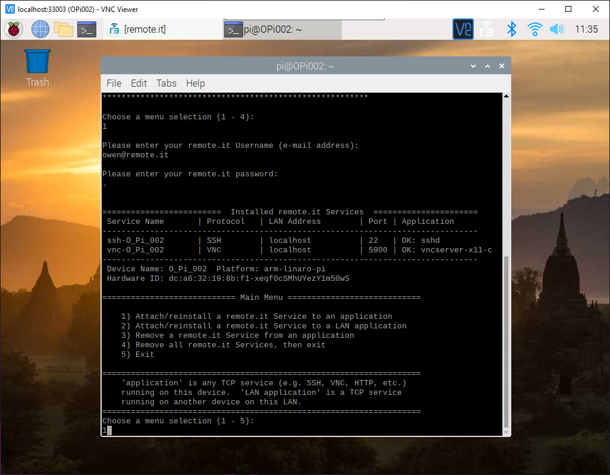
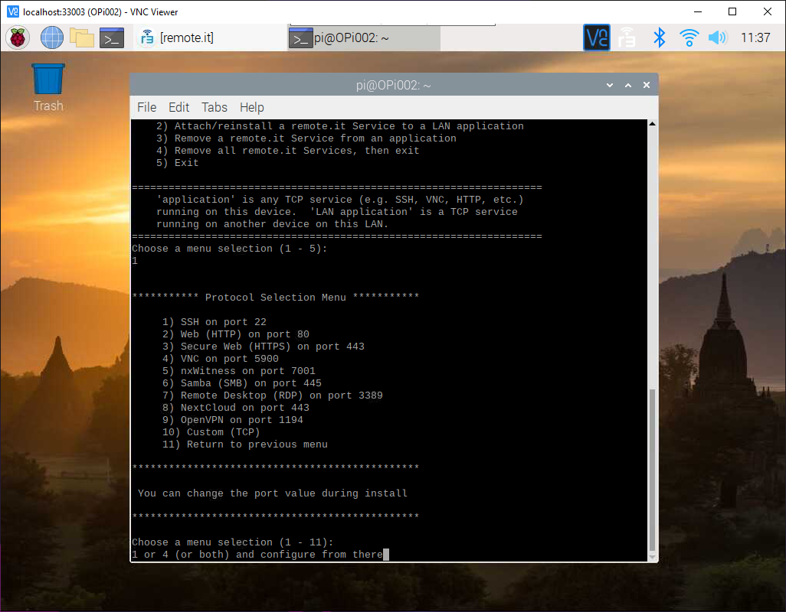

# Connecting to a Raspberry Pi with VNC or SSH \(Command Line\)

## Overview

In this guide you will learn how to configure a Raspberry Pi to be controlled from another machine using VNC or SSH through remote.it using the Interactive Installer. Following this tutorial will leave you with a secure connection between two machines that is quick and easy to access, as well as shareable and flexible.

Enabling your Pi to be remotely accessed is a relatively simple process. The steps are as follows:

1. Enable SSH and/or VNC on your Pi.
2. Download and install remote.it.
3. Add the SSH and/or VNC service to your device.
4. Install the remote.it desktop app on the device you want to access the Pi from, and connect.

## Enable SSH/VNC on your Pi

First, you'll have to enable the ability to SSH and/or VNC into your Pi. 

Access your Pi, then click the menu in the upper left corner and select _Preferences_ from the menu. 

Next, click Raspberry Pi Configuration and navigate to the _Interfaces_ tab. Make sure that either VNC or SSH \(or both\) are enabled. 

Now, let's set up remote.it! 


**NOTE:** If you would rather use the terminal to activate these options, you can run`sudo raspi-config` __and select option 5. You can then enable SSH and VNC from there.


## Install remote.it on your Pi

To VNC or SSH into a Raspberry Pi using remote.it, you have to install remote.it’s Interactive Installer using the terminal.


**NOTE:** If you want to use the Interactive Installer, be aware that you can only set up the VNC or SSH service, but you cannot use the Interactive Installer to VNC or SSH into your Pi. You’ll have to use the desktop app for that, which is explained in more detail later in the guide. 


To use the installer, you’re going to need a remote.it account. Make one ****[**here**](https://app.remote.it/auth/#/sign-up).

Launch the terminal. Make sure your Raspberry Pi is up to date by running the following commands:

`sudo apt update`

`sudo apt full-upgrade`

Then, install remote.it. Run:

`sudo apt install connectd`

`sudo connectd_installer`

You will see the Interactive Installer interface after running the last command. Sign in to your remote.it account.

## Add the desired services

The next step is to add the SSH and/or VNC services to your Device, so that you can access your Device using remote.it.

If you want to be able to SSH or VNC to the Pi, navigate to menu selection 1.

Then, select the appropriate Service\(s\) from the list that appears and configure them to fit your needs. 

The Service\(s\) will be added to your Device and you can now exit. The Pi is ready to be controlled remotely. 

## Install remote.it on the controller

Now that you've installed the Service\(s\), you can SSH or VNC into your Pi from any other machine. However, you cannot do this using the Interactive Installer. Instead, you'll have to download the remote.it desktop app on the controlling machine. You can find it [**here**](https://github.com/remoteit/desktop/releases/latest).

Log into the remote.it desktop app on the machine you wish to access the Pi from. The Device will appear under the _Remote_ tab. 

Click it, then connect to the desired Service. 


Downloading something like [**PuTTY**](https://www.chiark.greenend.org.uk/~sgtatham/putty/) \(Windows only\) for SSH or [**VNC Viewer**](https://www.realvnc.com/en/connect/download/viewer/) for VNC may be very helpful in connecting to your Raspberry Pi.


Click on the Service you are now connected to. Copy the information into the appropriate program, and connect. 

Voila! You are now connected to the Pi via SSH/VNC using remote.it!

