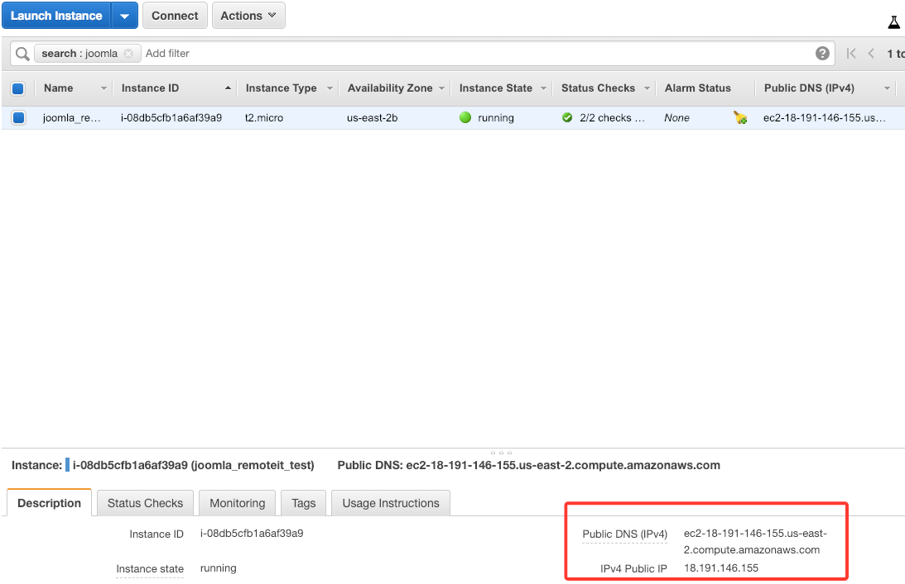
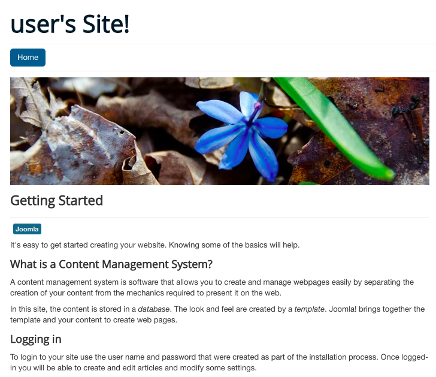

# Secure Joomla Admin on AWS EC2

## Overview

Joomla powers about 3% of all websites on the internet, and much like Wordpress, it is a common target for attacks.

Since the administrator login page can be accessed just by navigating to /administrator on the webpage, a brute-force attack is very common. Even if the username and password are very strong, as time goes one these bots will become better at guessing login credentials.

Admins can use Apache Htaccess rules to block access to /administrator from all senders excluding localhost. While providing increased security, admins themselves will then have a difficult time accessing the admin dashboard.

Fortunately, we can use remote.it to access the Joomla admin dashboard while it's blocked to the outside world. In this guide, we'll deploy a Joomla configured AWS EC2 instance, lockdown /administrator using Htaccess, and create a proxy connection to the dashboard using remote.it.

## Prerequisites

1. A remote.it account. [Don't have one?](https://app.remote.it/auth/#/sign-up)
2. An AWS account with EC2 privileges.

## Launch your AWS EC2 Instance

We'll be using an AWS EC2 to deploy our WordPress site. Specifically, we'll be using the [BitNami Joomla EC2 AMI](https://aws.amazon.com/marketplace/pp/B00NNZUP54). This AMI automates the installation and configuration of Joomla.

If you're new to EC2, follow this [AWS guide on how to configure and launch your instance](https://aws.amazon.com/getting-started/tutorials/launch-a-wordpress-website/). Make sure to select/generate an ssh key pair.

Enter the public IP address for your instance into your browser's search bar.

The page that appears will look something like this.

Notice how if you add `/administrator` to your route you can access the admin login page. This is the security issue we're going to fix. We want to block all public access to this page but still be able to access it via remote.it.
