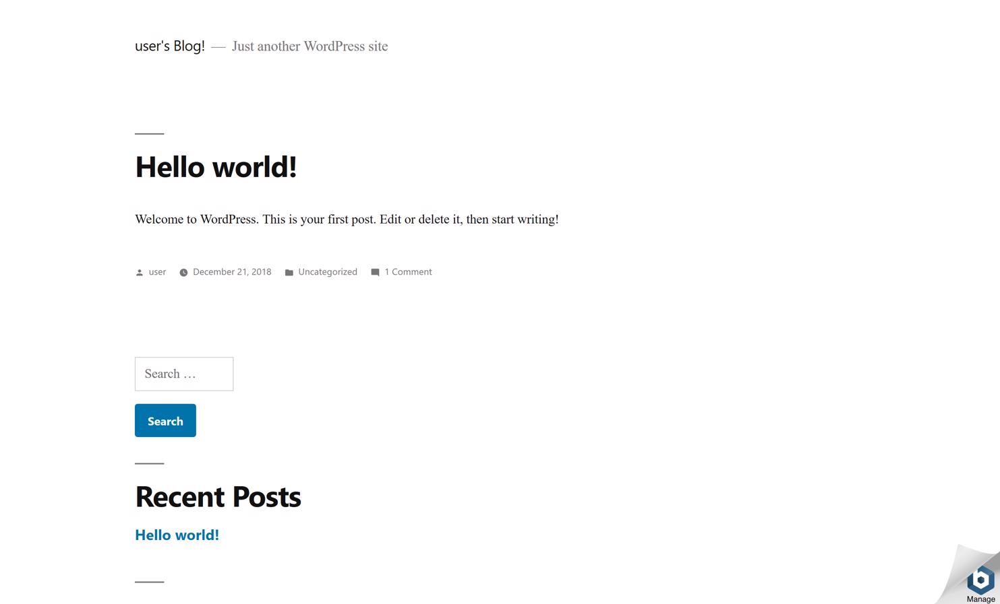
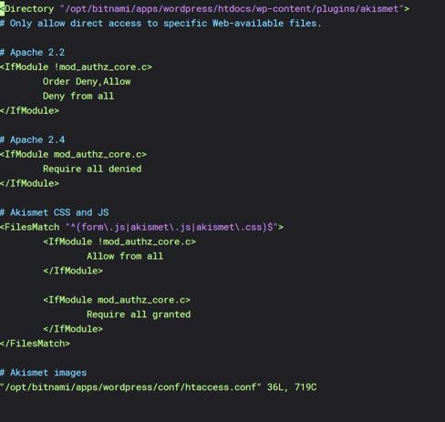
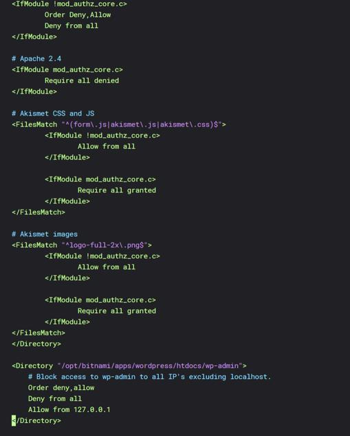

# Secure WordPress Admin on AWS EC2

## Overview

Wordpress powers approximately 32% of the top one million websites on the internet. Despite its widespread adoption, there exist many widely known security variabilities.

A common attack vector for WordPress websites is attackers gaining access to the WordPress admin dashboard (/wp-admin). Admins can use Apache Htaccess rules to block access to /wp-admin from all senders excluding localhost. While providing increased security, admins themselves will then have a difficult time accessing the admin dashboard.

Fortunately, we can use remote.it to access the WordPress admin dashboard while it's blocked to the outside world. In this guide, we'll deploy a WordPress configured AWS EC2 instance, lockdown /wp-admin using Htaccess, and create a proxy connection to the dashboard using remote.it.

## Prerequisites

1. A remote.it account. Don't have one? Register here!
2. An AWS account with EC2 privileges.

## Launch your AWS EC2 Instance

We'll be using AWS EC2 to deploy our WordPress site. Specifically, we'll be using the [BitNami WordPress EC2 AMI](https://aws.amazon.com/marketplace/pp/B00NN8Y43U). This AMI automates the installation and configuration of WordPress. An ssh key pair is optional.

If you're new to EC2, follow this [AWS guide on how to configure and launch your instance](https://aws.amazon.com/getting-started/tutorials/launch-a-wordpress-website/). Make sure to select/generate an ssh key pair.

Enter the public IP address for your instance into your browser's search bar.


The page that appears will look something like this.



Notice how if you add `./admin` to your route you can access the admin login page. This is the security issue we're going to fix. We want to block all public access to this page but still be able to access it via remote.it.

## Lockdown wp-admin using htaccess.conf

### SSH into your instance

We're going to use the key pair associated with your instance to connect via ssh. Run the following commands in your terminal.

```shell
chmod 400 PATH_TO_KEY
ssh -i PATH_TO_KEY ubuntu@INSTANCE_ADDRESS`
```


You've now SSHed into the EC2 instance! Now we can start securing the WordPress site.

## Lock down wp-admin using Htaccess

### What is Htacces?

Htaccess is a directory level configuration file that. among other use cases, can be used to block access to particular resources. In the bitNami WordPress AMI, there is a single Htaccess file that handles configuration for the entire appliation. This is the file we'll be accessing. To learn more about the BitNami WordPress AMI project structure, [check out the documentation](https://docs.bitnami.com/aws/apps/wordpress/).

### Edit The Htacces Configuration File

Run the following command to begin editing the website Htaccess configuration.

`vim /opt/bitnami/apps/wordpress/conf/htaccess.conf`



Add the following code to the bottom of the file.

```shell
<Directory "/opt/bitnami/apps/wordpress/htdocs/wp-admin">
    # Block access to wp-admin to all IP's excluding localhost.
    Order deny,allow
    Deny from all
    Allow from 127.0.0.1
</Directory>
```



Exit vim and run the folloiwng command to restart the web server.

`sudo /opt/bitnami/ctlscript.sh restart`

Once

## Install remote.it

```shell
sudo apt−get dist−upgrade
sudo apt-get update
```

```shell
sudo apt-get install remoteit
sudo remoteit
```

## Configure Your Device

## Generate The Proxy URL

## Connect To The Admin Dashboard
