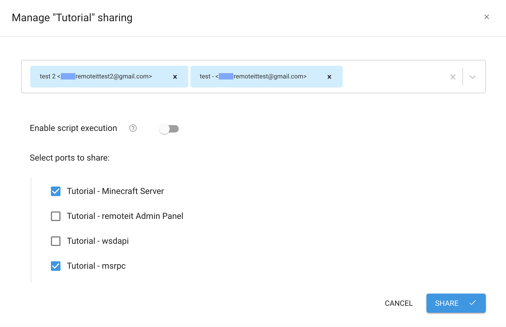
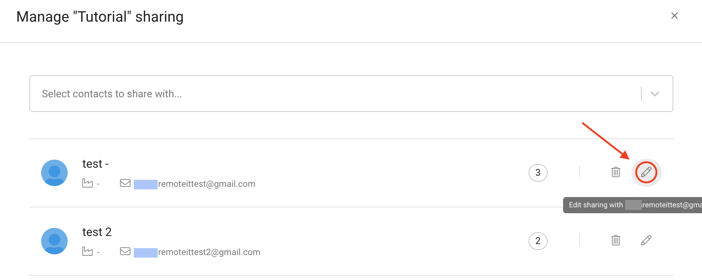
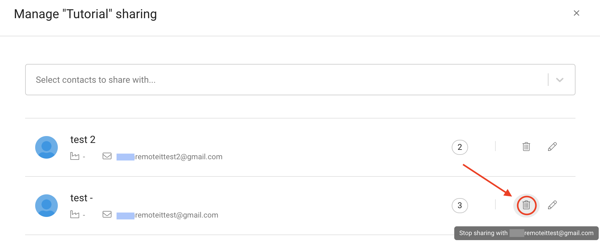
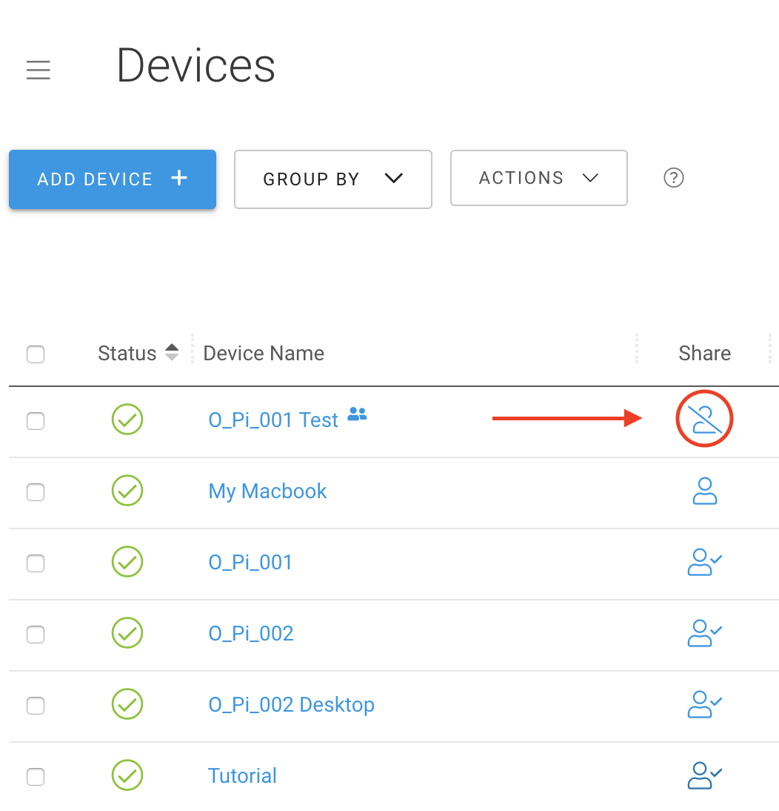

# Port Sharing

## What is Port Sharing?

Previously when you shared a Device, you were giving your contact access to every port on that Device. With Port Sharing, the owner of a Device is now able to choose which ports to share. Now you don't have to worry about managing private connections on a Device that you wish to share. 

This guide will go over the basics of how to use Port Sharing:

* \*\*\*\*[**Sharing**](port-sharing.md#sharing)\*\*\*\*
* \*\*\*\*[**Editing Access**](port-sharing.md#editing-access)\*\*\*\*
* \*\*\*\*[**Removing**](port-sharing.md#removing)\*\*\*\*

## Sharing

To share a device with Port Sharing, navigate to the _Devices_ page.

Next, locate the Device you want to share and click the Share symbol to the right.

The symbol with a checkmark signifies that the Device is currently being shared, while a symbol with no checkmark is an unshared Device.

After clicking the Share symbol, a menu will appear. Select the contacts you want to share with from the drop down menu, or type in their contact information. 


**NOTE:** While sharing with multiple contacts at once please keep in mind that you will assign the **same** permissions to all contacts you add.


Once you've selected the contacts you want to add to a Device, you can set their access. Choose which ports\(s\) you want to share and whether you want them to be able to execute scripts on your Device.


**NOTE:** If you enable Bulk Scripting but do not enable access to any ports, the shared user will still be able to run scripts on the Device.


Then click the _Share_ button. You will now see the contacts you added appear under the sharing menu, along with the ports they have access to.

## Editing Access

Port Sharing allows you to instantly update which ports you've shared to a specific user. To do this, click the Share icon next to the desired Device and then click on the Pencil icon next to the contact you wish to edit.

From here you can select and de-select access for the user, as well as enable and disable their ability to execute scripts, in the same way as when you were initially sharing the Device. 

When you are done editing their access, click the _Share_ button to save your changes.

## Removing

To remove a shared user from your Device, click the Trash Can icon. After a few seconds, the shared user will be removed from the Device and will no longer be able to connect. 

Additionally, if you would like to remove yourself from a Device simply click the Share icon with the slash through it, located next to the Device you wish to leave.

## Video tutorial

For a video tutorial, check out:



## More

Other helpful web portal guides:









To learn how to share devices without using Port Sharing, please proceed to the following guides.

