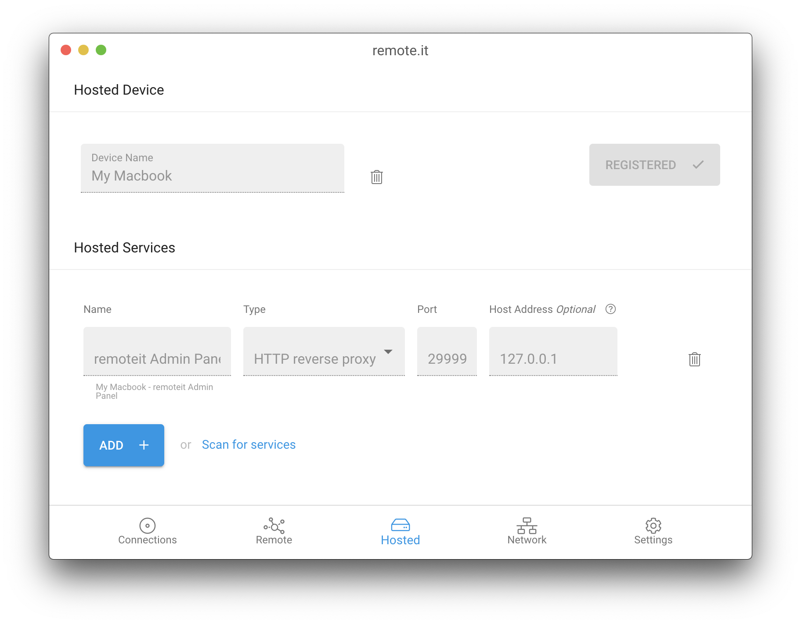
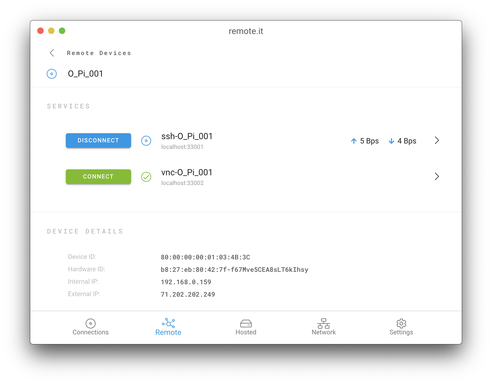
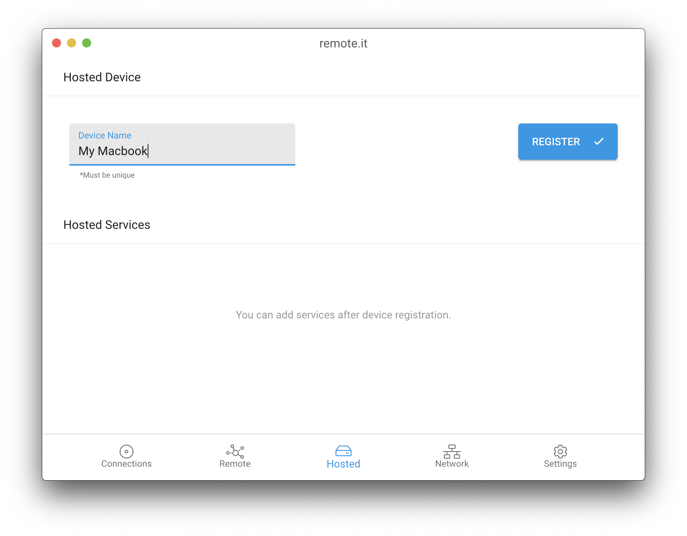
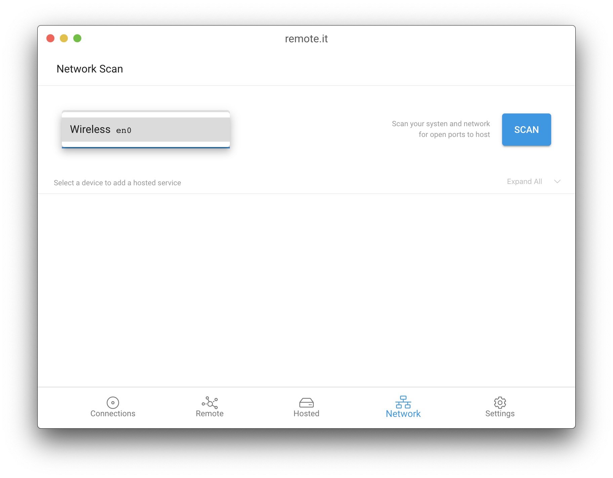
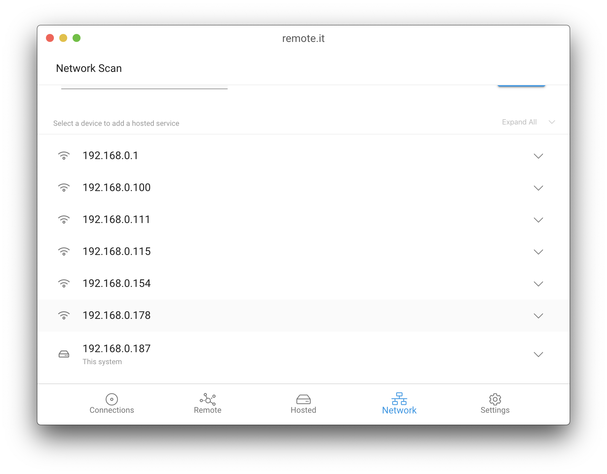
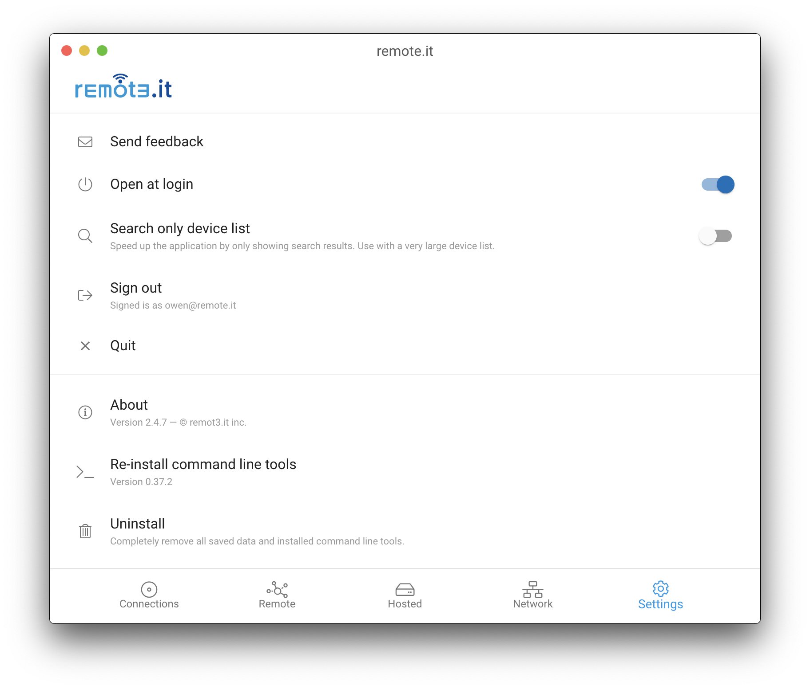

# Using the Desktop App

The new [remote.it](http://remote.it/) desktop application is a powerful tool that makes remote access to common software applications on remote computers and devices easy.

[**Download**](https://github.com/remoteit/desktop/releases/latest)\*\*\*\*

### Powerful connections

Every connection in Desktop is a direct peer to peer connection for the fastest speeds. Peer to peer connections also have the benefit of persisting until manually closed and feature throughput monitoring:

In addition the desktop app allows you to share a connection with other users on the network. You can connect to a remote device and allow other users to connect to it through your system on the port you choose. Your local shared connections have the same great security as a remote proxy, only on your private network.

**Advanced users** can easily change the local IP Address and Port that your connection is bound to.

### Quick launching

Having persistent connections makes it easy for you to bookmark and use remote.it in the background, but if you are in the app, you can also launch a few other services with a single click. HTTP, SSH, and VNC are all supported integrations.

### Hosted services

You can now easily setup a device through a simple interface. Mac, Windows, Ubuntu Linux and Raspberry Pi can all be quickly set up to host any local services. Web sites, SSH, VNC and RDP are common services people make available. And now with desktop you can also even share the remote.it Desktop admin panel so that you can remotely manage your remote.it services and connections.

When your system is set up as a host it will even run in the background as a system service, so you don’t even need to be logged in to access it through remote.it.

**Advanced users** can even jump host services from other systems on the local network. So if you would like to stream a video camera feed through remote.it without installing anything on your camera, it’s easier than ever. You just have to specify a “Host IP Address” of a system on the local network.

### Network scanning

Local area network scanning is now built in. Scan your network for local services and add them quickly and easily with a click:

**Advanced users** with two networks connected can even share connections across either network using out of band. For instance if servicing a system on a private connected network you could connect your cell network and provide remote.it access to the private system.

## How to use the Desktop App

### Launch

You can find the remote.it icon in the task bar. Clicking or right clicking allows you to quickly access the application. 

### Sign In

Enter your remote.it sign in credentials \(your email and password\) and click sign in. 


**Note:** Please be aware that when you sign in for the first time you will be prompted to enter your Administrator name and password. This is so that remote.it can install the necessary command line tools onto your device. 


### Navigation

There are 5 tabs; Connections, Remote, Hosted, Network, and Settings.

### Connections

Here you can see all the services you can connect too. A question mark indicates that the state of the device is unknown. A grayed-out circle with a dash indicates that service/device is offline. A green checkbox and circle indicates that the service/device is online. A blue circle indicates that the service/device currently has an active connection.

You can click on any online service to connect to it. This will provide you with a localhost address which you can use in your application.

The throughput of the connection is shown to the right of the connection. If you hover over the connection, you can copy the localhost address with the clipboard icon. Disconnect with the blue button.

You can also click on a connection to see more information.

### Remote

Here you will find all the devices you have access to. You can search, sort, and refresh your devices with the tools at the top of the page. Below that you will see all your devices displayed, either in alphabetical order or by device state. 

Next to each device you can see the number of services and the connection state of the services.

Click on a device to manage its services, in a similar way to the connections tab. Here, you can also see the device details at the bottom. 

### Hosted

In this tab you can register and add services to your local device. First, choose a name and click the register button. At this point, you may be asked to enter your administrator information.

After you've registered your device you can either add your own custom service or use the network scanner to automatically find potential services.

There are many different kinds of services you can add. Some examples are SSH, VNC, HTTP, and TCP. To add one of these services, click add. Give it a name and select the service type. The port will be filled in automatically, and you can change the host address if you wish. Then click the blue checkmark to save it.

### Network

Next is the network tab. You can get here either by pressing the network icon in the bottom bar or by selecting Scan for services under the Hosted tab. The app will autodetect what network you are on, but if you are connected to multiple networks and want to select a different one, you can use the dropdown menu in the upper left.

Using the scan button will scan your current network for devices. From there you can click on a device to see the possible services available to add. Your local system will be labeled and have a different icon. 

From there you can click on a device and add services with the click of a button. Just press add and you will be taken to the Hosted tab to finish setting up.

### Settings

Finally, we have the Settings tab. Here you can sign out, quit, send feedback, and more. At the bottom you will see more advanced options, like the ability to re-install the command line tools and an uninstall function. 

### Troubleshooting

If you run into an issue or have any questions, please don't hesitate to submit a ticket on our [support site.](https://remot3it.zendesk.com/hc/en-us)

Thank you, and we hope you enjoy remote.it.

