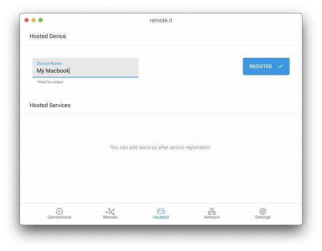
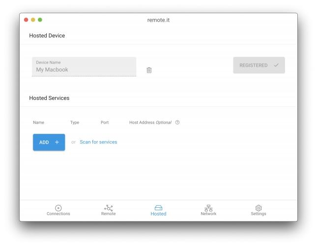
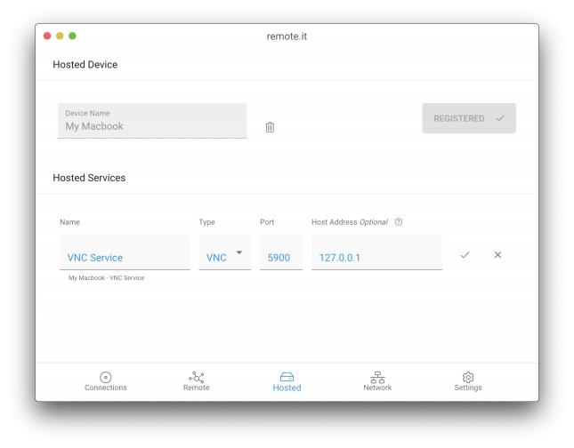

# Hosted

In this tab you can register and add Services to your local Device. First, choose a name and click the register button. At this point, you may be asked to enter your administrator information.

After you've registered your device you can either add your own custom service or use the network scanner to automatically find services on the LAN or your Device.

There are many different kinds of Services you can add. Some examples are SSH, VNC, RDP, HTTP, and TCP. To add one of these Services, click "ADD". 

Give the new Service a name and select the Service type. A typical value for the port will be filled in automatically, however you can change the port and/or host address if you wish. Then click the blue check mark to save this Hosted Service.

