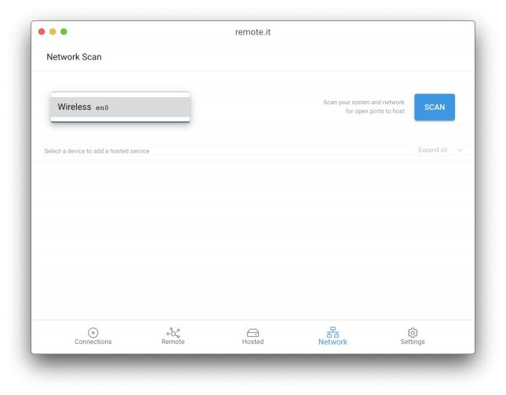
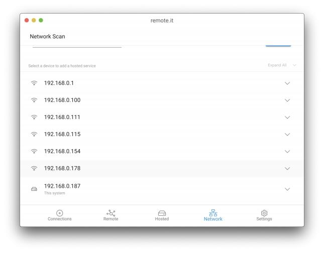

# Network

 You can get here either by click the network icon in the bottom bar or by selecting "Scan for services"  
 under the Hosted tab. 

The App will auto-detect which network adapter you are currently using, but if you are connected to multiple networks and want to select a different one, you can use the dropdown menu in the upper left.

Clicking the "SCAN" button will scan your current network for active TCP services. From the displayed list you can click on an IP address to see the possible TCP services available to add remote.it Services to. Your local system will be labeled "This system" and have a different icon.


Known issue: all possible IP addresses are shown, rather than just the ones which are present on your LAN.


### Expanded network scan results

Click on the down arrow on the right side to expand the view in order to see the detected TCP services at the shown IP address.  Click on the up arrow to hide the details.

Click on "ADD" to add a remote.it Service to this IP address and port.  You will be taken to the "Hosted" tab to complete configuration.

