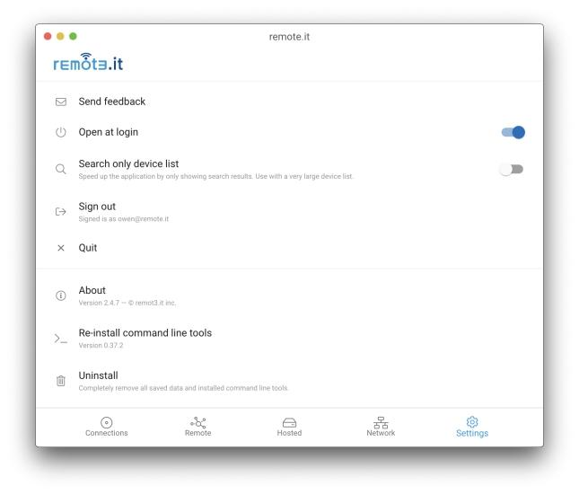

# Settings

* **Send Feedback** opens your default e-mail client and creates an e-mail to support@remote.it.
* **Open at Login** - opens the Desktop App when you log in.  Note that Hosted Services and active Connections will keep running whether the Desktop App is open or not.
* **Search only device list** - select this option if you have a large number of Devices in your account.  You will then need to enter a search term to find the Devices and Services you wish to connect to.
* **Sign Out** signs you out of your account but leaves the App open.
* **Quit** signs you out of your account and closes the App.
* **About** shows you the current version of the App.  If there is an update available, you will see:

* **Re-install command line tools** reinstalls the utilities used by the Desktop App.  Support might suggest that you this in the event there is any problem with your connection.
* **Uninstall** unregisters any Hosted Services, then removes all of the locally installed software, and finally exits the Desktop App.

