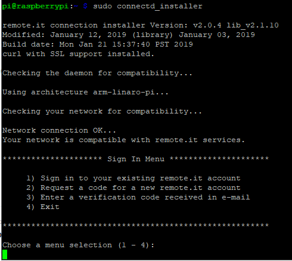
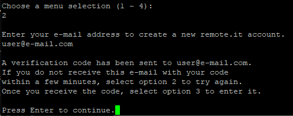

# Create a new account \(optional\)

If you haven't yet created an account, you can do so from the interactive installer's Login Menu.

At your device's console, run:

_sudo connectd\_installer_

Select option 2 to create a new account.

You will receive a verification e-mail within a few minutes.  In rare cases these can wind up in your spam folder, so check there if you don't receive an e-mail in your inbox within 5 minutes.

Once you receive the verification e-mail with the code, choose option 3 to enter the verification code.  You will also enter and confirm your password during this step.

