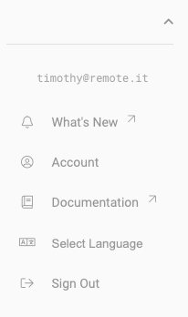

# Using the Web Portal

The web portal \(app.remote.it\) is an interface to make connections with remote.it. Currently, the web portal creates **proxy connections**, which route information through one of our proxy servers.


Prerequisites: You'll need a remote.it account, which you can create at https://app.remote.it.


### The Left Menu

When you log into the portal, the first page will be the Devices page. You can navigate to other pages using the menu on the left hand side.

If you have one, your gravatar will appear on the top. The dropdown arrow will reveal a few other helpful pages, including external links \(marked with a small arrow\), the account you're on, and account settings.

In general, you can click/hover on question mark icons throughout the portal to get documentation and/or tooltips on how to use important functions.

### Main Pages

#### Devices

This page gives you a list of your devices and their properties/services. Furthermore, it allows you to make connections to devices and manipulate them. For most users, this is their main page. [Tutorial]()

#### Contacts

This page gives you a list of contacts with other remote.it accounts to share devices with. [Tutorial]()

#### Scripting

This page allows you to upload, store, and run scripts on your remote.it devices. [Tutorial](../device-scripting-running-scripts-on-your-devices.md)

### Other Pages

These are pages in the dropdown of the left menu.

#### What's New

An external link to release notes on the web portal.

#### Account

Here, you can change your account's settings.

#### Documentation

An external link to this docs site.

#### Select Language

Used to select whether to use English \(default\) or Japanese in the portal.

#### Sign Out

Used to sign out of your remote.it account.

### Advanced Pages

#### Registrations

This page is used for bulk registration of devices. [Tutorial](../../mass-production/bulk-registration.md)

#### Products

The products page is also used for bulk registration of devices. [Tutorial]()

