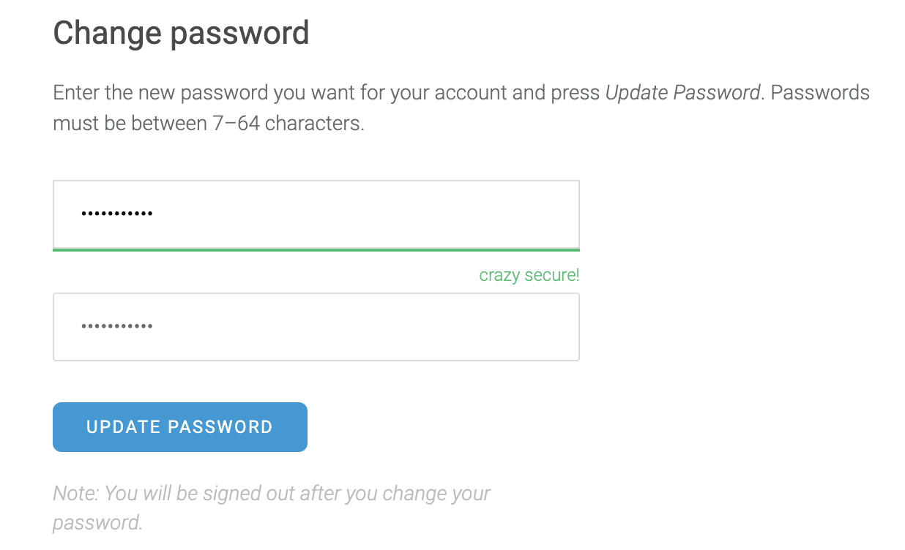

# Changing your Password

Go to the Account page in the dropdown left menu, and go down to "Change password".

Enter your new password twice, as shown, then press "UPDATE PASSWORD". This will log you out of your account if the passwords match. Otherwise, you'll get an error message.

