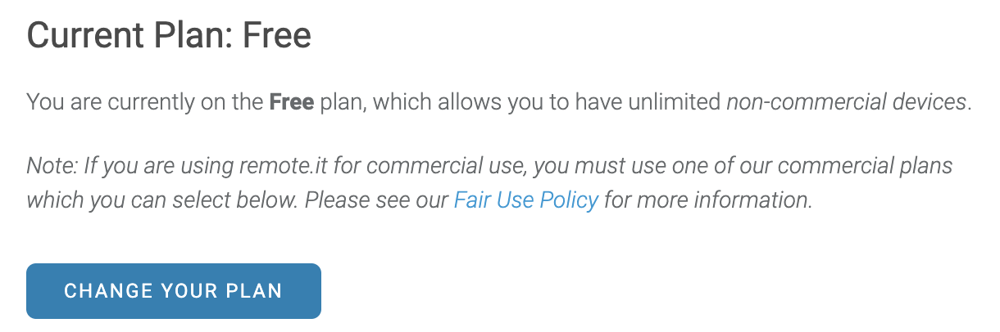

# Changing your remote.it Plan

If you're using a large number of devices or are using them for your company, you'll need to get a commercial plan. To upgrade or downgrade, go to the top of the account page in the dropdown menu:

Press "CHANGE YOUR PLAN," then select the account type you want. Input your credit card credentials and follow the remaining instructions.

| Account Type | Description |
| :--- | :--- |
| Free | Default type; unlimited non-commercial devices |
| By Device | Pay $2/month per commercial device |
| By Seats | Pay $50/month per user; more economical for &gt;25 devices o |

