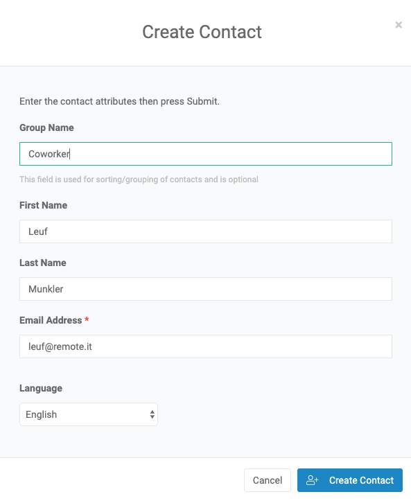
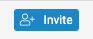
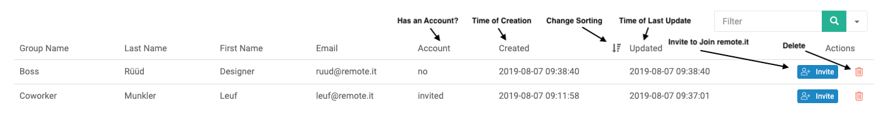

# The Contacts Page

The contacts page is where you add other remote.it accounts to share devices with.

### Creating a Contact

To create a contact, press the "CREATE CONTACT" button. This brings up the following dialog:

Only the email address is necessary, but you can optionally add the user's First/Last Name for convenience. You can also set their language to Japanese, and/or give them a group name, which is used for organizing contacts.

If that user does not exist, then their contact will have an invite button next to them in the grid. This will invite them to create a remote.it account.

### The Contacts Grid

The contacts grid has eight columns. You can sort by any column by clicking on an icon on the right portion of the column's header. You can also filter contacts with the filter input in the top right.

| Column | Description |
| :--- | :--- |
| Group Name | Group the contact is under. |
| Last Name | Last name of the contact. |
| First Name | First name of the contact. |
| Email | Email of the user. |
| Account | Whether that user has an account. "yes" if they do, "invited" if invited, and "no" otherwise. |
| Created | The timestamp at which the contact was created. |
| Updated | The timestamp at which the contact was last changed \(by being invited, for example\). |
| Actions | List of actions to take. "Invite" invites a user to join remote.it, and the trash can lets you delete the contact. |

### Removing a Contact

You can remove a contact by pressing the red "trash can" next to the contact. This will bring up a confirmation dialog to prevent accidental deletion.

