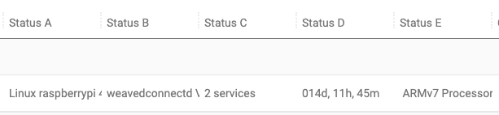
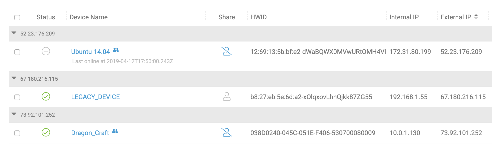

# The Devices Page

The Devices page is a sortable and filterable view of all of the devices registered to your account. As with any page, it is accessed from the left menu.

### The Device List

The device list is the table underneath the action buttons. Normally, each device on your account has a row in this table.

Here is what each column represents.

<table>
  <thead>
    <tr>
      <th style="text-align:left">Column</th>
      <th style="text-align:left">Description</th>
    </tr>
  </thead>
  <tbody>
    <tr>
      <td style="text-align:left">Status</td>
      <td style="text-align:left">A green icon if your device is online, and a gray icon if not.</td>
    </tr>
    <tr>
      <td style="text-align:left">Device Name</td>
      <td style="text-align:left">
        
Shows the name of your device and the last time it was online.

        
Clicking on the device brings up an interface for connecting to that device.

      </td>
    </tr>
    <tr>
      <td style="text-align:left">Share</td>
      <td style="text-align:left">
        
Whether the device is shared. Clicking on this icon for a shared device

        
allows you to unshare the device.

      </td>
    </tr>
    <tr>
      <td style="text-align:left">HWID</td>
      <td style="text-align:left">The Hardware ID of the device, which is shared by all the services on
        a Device.</td>
    </tr>
    <tr>
      <td style="text-align:left">Internal IP</td>
      <td style="text-align:left">The internal IP address of the device.</td>
    </tr>
    <tr>
      <td style="text-align:left">External IP</td>
      <td style="text-align:left">The external IP address of the device.</td>
    </tr>
  </tbody>
</table>The leftmost column of checkboxes is used to select groups of devices for "[bulk actions](https://remot3it.zendesk.com/hc/en-us/articles/115002042431-How-do-I-use-the-remote-it-Actions-menu-)" such as sharing, deletion, or running a script.

### The Status Columns

The five status columns \(named Status A through Status E\) can be used to get information from your devices using [Device Scripting](../../device-scripting-running-scripts-on-your-devices/).

### Category Columns

The Category columns contain optional, user-specified information entered during bulk registration or set manually using the "Set Category" action.

### Add Devices

This button doesn't magically add your devices—that would be impossible—but it provides tutorials for how to add your devices of various OSes.

### Grouping Devices

You can group devices by using the dropdown named "GROUP BY," next to the "Add Devices" button. Selecting a property to group by creates "folders," one for each value of that property appearing in the device grid. For example, here is grouping by External IP:

### Actions Menu

The simplest way to manipulate devices is the Actions Menu, which you can learn more about [here](using-the-remote.it-actions-menu.md).

