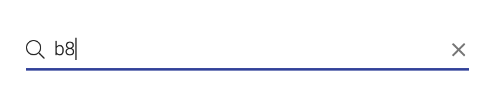
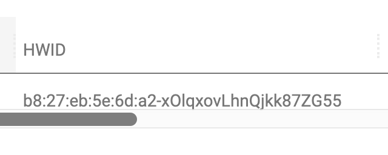
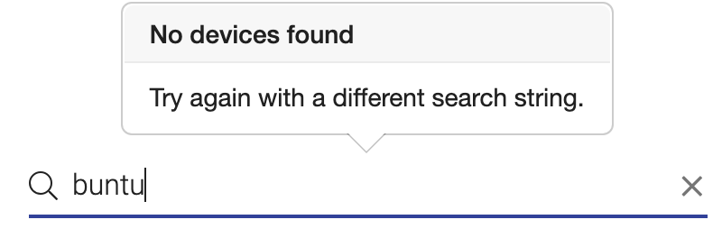

# Searching and Filtering Devices

The standard "View Devices" page in remote.it works well if you have up to a few dozen devices, but beyond that, it becomes difficult to find a specific device without scrolling around.  You can make your life easier by searching for and filtering devices. This is done in the text input in the top right of the page.

Checking "Device search only" uses searching instead of filtering.

### Filter Mode

Filter mode finds the entered string anywhere in the Device list \(in any column\) and is case-insensitive.  This mode is the default mode of your account.

### Search Mode

Search mode doesn't display _any_ Devices until you press enter after the search string. To use search mode, check "Device search only" \(adjacent to the search box\).

Search mode works a little differently than Filter mode.

* To match the search string **at the beginning** of the Device Name, enter the search string.
* To match the string **anywhere** in the Device Name, add an asterisk \(\*\) at the beginning of the search string.
* You have to press "Enter" after typing in your search term, to start the search.
* Search mode is also case-insensitive \(cow and COW are treated the same\)

| Query | Result |
| :--- | :--- |
| Ubuntu | Matches any device whose name starts with "ubuntu" \(any case\). |
| \*buntu | Matches any device which contains "buntu" \(any case\). |
| buntu | Matches any device starting with "buntu" \(any case\). |

Here's an example of what happens when no devices are returned by the search:

