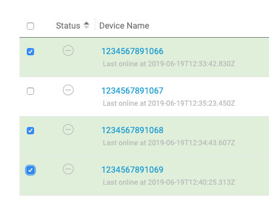
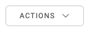
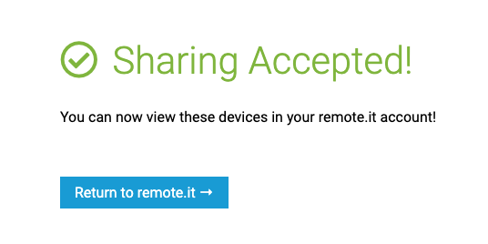
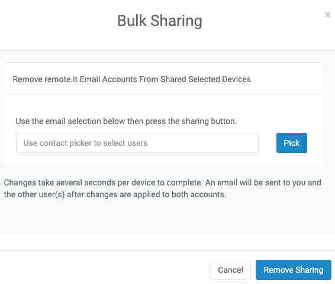
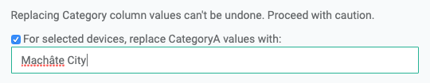
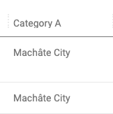
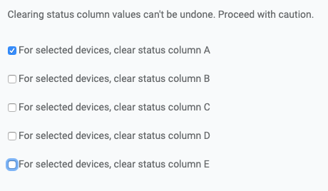
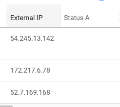

# Running Actions on Devices

There are two main ways to manipulate devices: the actions menu and manipulating them individually. The actions menu allows you to manipulate a set of devices. The workflow of this operation is to 1. select a set of devices and then 2. run an action on them.

### Selecting Devices

You can select a set of devices using the checkboxes in the leftmost column. To select all devices, press the checkbox at the top of the page.



To select a more specific set of devices, you can search a query, then press the select all devices button.

### Running Actions

Once you've selected a set of devices, you can run actions on them with the "ACTIONS" drop down on the top of the Devices page.



 The following Actions are available in remote.it; they are self-explanatory.


### **Share**

Sharing a device allows other users to access a device or devices in your account. This is useful for allowing teams of people \(each with their own login credentials\) to have access to a single device. The device owner has complete control of what other remote.it accounts may connect.

In order to share a device in your account, the other user must also have a valid remote.it user account. After selecting the device\(s\) you wish to share, press "Share" in the Actions dropdown. This should take you to a sharing interface. Then, enter in the username of the account to share it with \(in the following case, _timothy@remote.it_\).


Once you press Add Sharing, a confirmation email will be sent to the user containing an accept invitation link. Clicking on this link will take you to a confirmation page:



Once the device is shared, the Share column icon will change, indicating that device is shared to another user.


There is a delay from the time you share a device\(s\) to another user until the device appears in their Devices page. Please be patient and **check your email for confirmation** __that the request was received. It may take as long as 5–10 minutes after the email notification until the share status is updated and is shown in the Devices page.


For more information:



### **Stop Sharing**

When you want to unshare a device or a set of devices \(either from yourself or from others\), you can use the Unshare action in the menu. In this dialog, you can press the "Pick" button to choose which contacts to unshare the device from. 



Once the list of email accounts to unshare from is complete, press "Remove Sharing" to unshare the device\(s\).

Note that if a device is shared to you, you will need to create a contact for the other person to use this method. A simpler method to unshare such a device is to just click on the icon in that device's Share column.


There is a delay from the time you unshare devices until the devices disappear from the other user's Devices page.


More information:





### **Delete**

Deletion simply constitutes removing the selected devices from your list. The device **must be offline** to remove it from the device list. Please note this action does **not** remove/uninstall any code from your device. In order to uninstall or remove all remote.it software from your Linux device, use the Debian dpkg utility:

```bash
sudo dpkg --purge connectd
```

On Windows, simply uninstall remote.it Connect for Windows.

If you wish to reinstall services on a device which was deleted from your account using the web portal actions menu, see this [Help Article](https://remot3it.zendesk.com/hc/en-us/articles/360021623891--etc-connectd-services-Connectdssh22-conf-is-not-registered-to-this-account).

### **Execute a Script**

Scripts can be used to perform custom, specific actions on your devices. The status columns can be updated to reflect the Script actions that were performed. The script is run on all selected devices.

For more information:



### **Set Category**

Category columns allow you to add additional arbitrary information to the selected devices. Once you add the details, the Category columns can be used to sort and group devices.

As an example, you could add a city name to a set of selected devices in Category A column. Then, you can sort, group or filter devices by Category A; those devices will be grouped into one folder.





### Grouping Devices

The grouping dropdown lets you group devices into a folder-like organization with whatever characteristic you choose. For example, you might group devices by Status A, which you've decided represents the type of device.

### Transfer Device

This action transfers the selected device\(s\) to another remote.it account. You must create a contact for that account before you transfer \(see [Contacts](../the-contacts-page.md)\). After the transfer is completed, you will no longer see the Device in your account, and it will appear in the selected contact's account.


Device transfer can be performed only on the owner's device. Devices shared from other accounts can not be transferred.  Also, please be aware that the share information will be cleared with the transfer.


### **Clear Status**

After running a bulk script which writes status info into the Status columns, you may choose to clear a Status column if it is no longer required. Clear Status does not impact the Script that was previously executed; it simply clears the entries in the Status column.





If you have any issues/questions, check out the [forum](https://forum.remote.it) or email support@remote.it.


