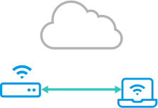

# Peer to Peer vs Proxy Connections

## Peer to Peer Connections



In order to make a peer to peer \(P2P\) or direct connection the remote.it connectd daemon needs to be running on both systems, but has several advantages over using a proxy connection.

* Data does not pass through our servers. Only the connection initialization touches the cloud.
* Data throughput is significantly faster.
* The connection will stay active as long as there is an internet connection available to both devices.
* The URL will remain the same and can be bookmarked.

A P2P connection looks similar to:

```text
127.0.0.1:34000
```

* 127.0.0.1 is a "localhost" address.
* 34000 is a user-configurable port to use for this connection.

To learn how to make a P2P connection, please see:





## Proxy Connections


Cloud proxy connections are the simplest to set up and test with as you only need our connectd daemon on the target device. However there are limitations compared to a direct P2P connection.

* URL and port will change every time you connect
* There is an 8 hour time limit before the connection will auto-close

To learn how to make a proxy connection, click on the link below.



