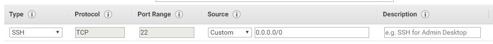
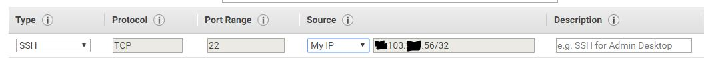

# Configure your Security Group

Initially you'll have to set up a security group to control the types of traffic and source IP addresses that your AWS EC2 instance will allow.  By default the source IP is set to 0.0.0.0, meaning there is no restriction on the source IP at all.  

You should set this to "My IP" which allows you to SSH into the VM from your current location \(as identified by your public IP address\), but will block all other source IP addresses.

