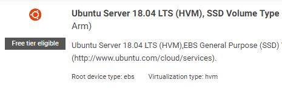

# Create an AWS EC2 Ubuntu instance

Install a new Ubuntu EC2 instance with the CPU power and features you want.  For example, you may choose to start with a pre-configured LAMP system if your intention is to use the VM as a web server.  Here we've chosen a generic Ubuntu 18.04 EC2 image to start with.

